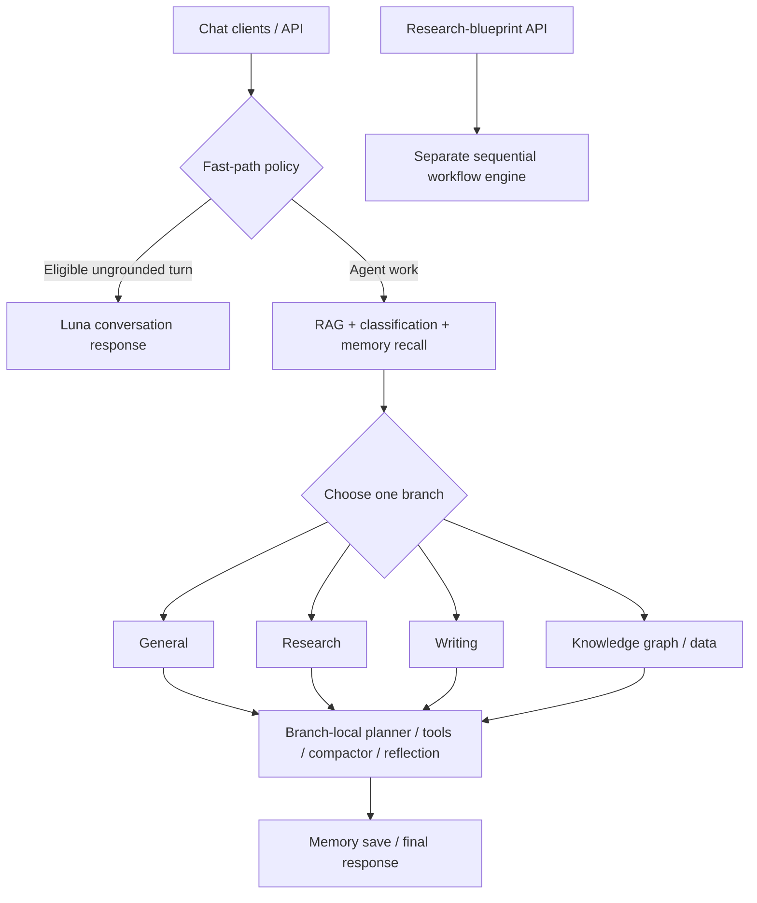

# Agent orchestration and release readiness audit

Date: 2026-09-25. Status: completed source audit with offline diagnostic verification; **major feature release not cleared**.

Source: `develop`, commit `e06bae5043b4433423dc53e2dcda4ab7682c6b1e`, plus the pre-existing working-tree changes. This is a dated evidence record, not a replacement for the [engineering contracts](../engineering/README.md), [evaluation contract](../../evals/AGENTS.md), or [production baseline](../operations/agent-production-baseline.md).

## Decision and scope

**The agents and tools are not consistently coordinated.** There is substantial shared infrastructure: a central registry, intent routing, scoped tool execution, approval gates, checkpoints, streaming event persistence, and several deterministic guards. However, prompts, planners, nested generators, and lifecycle adapters disagree at important boundaries. A major release should wait for the confirmed correctness defects and the missing current-release evidence below.

Inspected all four chat execution paths, all 25 registered tool descriptors and their bindings/policies, shared and specialist prompts, planning/reflection/compaction, memory and evidence helpers, nested drafting/summary/extraction prompts, durable execution and browser adapters, the separate research-blueprint workflow, CI, evaluation baselines, and rollout configuration. “Inspected” does not mean every tool was executed against its real service. Offline probes use synthetic content, mocked models/connectors, or in-memory SQLite. No production writes, live model calls, deployments, or application fixes were performed. Existing user edits were preserved.

### Architecture and capability inventory



This diagram collapses each branch's own loop for readability; it does not imply a shared tool pool. The parent [graph builder](../../backend/src/services/agent/_builders.py#L146) routes once and sends each completed specialist to memory save and END. There is no delegate tool or specialist-to-specialist handoff edge. The [classifier rubric](../../backend/src/services/agent/classifier.py#L149) correctly acknowledges that no branch may fit a multi-branch request. A task requiring Python plus saved drafting, for example, has no complete single-turn branch. Cross-branch composition is a product capability decision still to resolve, not something prompt wording alone supplies.

Registry-derived inventory from [tools.py](../../backend/src/services/agent/tools.py#L1027). “Approval” means the registry marks the tool destructive and the graph uses that policy for confirmation; it is not a claim about successful live execution.

| Tool | General | Research | Writing | Data | Approval |
|---|---|---|---|---|---|
| `search_arxiv` | yes | yes | yes | — | — |
| `ingest_arxiv_papers` | yes | yes | yes | — | yes |
| `search_documents` | yes | yes | — | yes | — |
| `do_kb_retrieve` | yes | yes | — | yes | — |
| `create_project` | yes | yes | yes | — | yes |
| `list_projects` | yes | yes | yes | yes | — |
| `add_document_to_project` | yes | yes | yes | — | yes |
| `create_project_note` | yes | yes | yes | — | yes |
| `list_project_documents` | yes | yes | yes | yes | — |
| `get_current_draft` | — | — | yes | — | — |
| `summarize_document` | yes | — | yes | — | — |
| `compare_documents` | yes | — | yes | — | — |
| `extract_entities` | — | — | — | yes | — |
| `search_knowledge_graph` | yes | — | — | yes | — |
| `explore_entity_neighborhood` | — | — | — | yes | — |
| `find_entity_paths` | — | — | — | yes | — |
| `get_graph_stats` | — | — | — | yes | — |
| `create_draft` | — | — | yes | — | yes |
| `revise_draft` | — | — | yes | — | yes |
| `export_bibliography` | — | — | yes | — | — |
| `execute_code` | — | yes | — | — | yes |
| `search_external_database` | yes | — | yes | — | — |
| `list_external_databases` | yes | — | yes | — | — |
| `forget_memory` | yes | — | — | — | yes |
| `load_project_skill` | conditional | conditional | conditional | conditional | — |
| **Unconditional count** | **15** | **10** | **15** | **9** | |

The conditional loader is bound when project-skill runtime is enabled and state contains a frozen snapshot and nonempty catalog ([binding](../../backend/src/services/agent/_nodes_llm.py#L89)). Its specialist execution permission is explicitly included in the [factory allowlist](../../backend/src/services/agent/subgraphs/_factory.py#L197); no loader-versus-allowlist defect was found. `ALL_TOOLS` is a 22-tool compatibility view, not any branch's runtime capability set. Top-level intent metadata also differs from specialist binding membership.

The agent's external-database tools wrap a separate [registry of 11 built-ins](../../backend/src/services/connectors/__init__.py#L92): PubMed, UniProt, ChEMBL, PubChem, SEC EDGAR, FRED, Alpha Vantage, ZINC, COSMIC, ClinicalTrials, and BioServices. Actual availability depends on each connector's configuration. Their schemas/dispatch boundary were inspected; this audit did not certify eleven live provider integrations. Chat exposes search/list through these tools, not a generic external-result fetch/import operation.

## Confirmed high-priority defects

P1 means a high-priority correctness issue to resolve before a major release; it does not imply a reproduced production incident or security exploit.

### A01 · P1 · A delayed job update can resurrect a completed run

[agent_run_service.py:193](../../backend/src/services/agent/agent_run_service.py#L193) checks terminal status in Python after reading a row, then commits an unguarded ORM update. Two writers can read RUNNING; one completes the run, and the other subsequently writes AWAITING_CONFIRMATION. A second fallback write also lacks a transition predicate.

**Evidence:** the [concurrent state probe](agent-orchestration-2026-09-25/lifecycle_state_probe.py) calls the real `upsert_run` with two SQLAlchemy sessions and a barrier after the delayed read. A fresh third session sees `awaiting_confirmation` after the other writer completed. SQLite reproduces the race; a Postgres concurrency test remains necessary.

**Impact / repair:** terminal runs can regain an active-thread slot and expose obsolete approvals. Use an atomic conditional transition, handle affected-row outcomes, and test completion/cancellation/confirmation/sweeper orderings on Postgres.

### A02 · P1 · Global panel Stop does not stop its durable fallback job

The global panel's [stopGeneration](../../frontend/src/store/agentChatStore.ts#L1425) aborts browser work and labels running tools cancelled. After the [Trigger fallback dispatch](../../frontend/src/store/agentChatStore.ts#L622), that controller governs browser polling, not the independent [Trigger task](../../src/trigger/agent/execute-agent.ts#L123) or backend job. No server cancellation is sent from this path.

**Trigger:** with Trigger fallback configured, approve a tool, then press Stop during the backend continuation. The UI can say stopped while execution continues. This is source-traced; no live Trigger job was started. The active `/chat` hook has a separate durable-stop path and should not be described as sharing this exact defect.

There is a related backend contract gap: the [cancel endpoint](../../backend/src/api/agent/execute.py#L985) accepts an owned queued/running run, but the [queued graph runner](../../backend/src/services/agent/agent_execution_service.py#L2493) and [resume runner](../../backend/src/services/agent/agent_execution_service.py#L2894) do not poll its cancel marker while awaiting the graph. The state probe shows STOPPING can become COMPLETED with the marker still set. Wire cancellation through the actual producer and wait for terminal acknowledgement; reconcile Trigger's handling of cancelled status too.

### A03 · P1 · A crash between a side effect and its receipt permits replay

In [_nodes_tools.py](../../backend/src/services/agent/_nodes_tools.py#L422), receipt lookup fails open, the tool executes, and the receipt is committed afterward in a separate session. A crash/cancellation between those operations leaves no durable record of the committed action. The [receipt model](../../backend/src/models/agent_tool_receipt.py#L22) also stores no result; replay with an existing receipt returns only `already_executed`, losing IDs needed by downstream tools.

**Evidence:** the [orchestration probe](agent-orchestration-2026-09-25/orchestration_probes.py) injects cancellation at receipt recording and invokes the same call again. The mocked side-effect executor runs **twice**. An existing receipt then yields no `note_id`. This demonstrates the execution boundary; it did not create real duplicate notes.

**Repair:** use stable operation idempotency keys and persist the operation's result. Make local writes and receipts atomic where possible; use provider-supported idempotency for external effects. Cover crash-before/after-commit, concurrent replay, receipt-store outage, and dependent ID recovery. Disabling ordinary tool retries does not close this crash window.

### A04 · P1 · General-agent error termination can return an earlier turn's answer

The general [error breaker](../../backend/src/services/agent/_builders.py#L77) exits to reflection after three errors without normalizing a pending contentless tool-call message. The specialist factory has additional terminal-message repair. Queued [initial](../../backend/src/services/agent/agent_execution_service.py#L2529) and [resumed](../../backend/src/services/agent/agent_execution_service.py#L2924) result extraction search all earlier AI messages, including previous user turns.

**Evidence:** the compiled-graph probe produces three tool permission errors and a fourth unanswered call. The actual extraction predicate selects `STALE PRIOR TURN ANSWER` from the preceding turn.

**Repair:** require a final answer belonging to the current turn, share terminal normalization across all branches, and bound result extraction at the latest user message. Error exhaustion must yield an honest current-turn failure/partial result.

### A05 · P1 · Read-after-write verification can return stale cached state

[tool_dedupe.py:126](../../backend/src/services/agent/tool_dedupe.py#L126) reuses successful same-name/same-arguments results from the current turn without invalidating reads after mutations. `list_project_documents` → `add_document_to_project` → the same list call returns the pre-write listing. Fully cached batches then [force final synthesis](../../backend/src/services/agent/_builders.py#L112).

**Evidence:** the orchestration probe supplies that valid tool history to the real tool node. It makes **zero fresh reads**, returns the cached empty project, and routes to forced synthesis.

**Repair:** separate mutation replay protection from read-result caching. Invalidate affected reads after writes, or explicitly allow fresh verification reads. Test project creation/attachment, note/draft changes, and pending-to-completed operations.

### A06 · P1 · All three shipped research templates verify against empty evidence

The separate workflow's [search step](../../backend/src/services/research_engine/step_executor.py#L129) emits `source_records`. Its [verification step](../../backend/src/services/research_engine/step_executor.py#L166) reads only `source_text`, `evidence`, or `context`; none of the three shipped templates supplies those aliases. Extract/synthesize return only `content`. Consequently verification checks the answer against an empty string and the default engine pauses before export.

**Evidence:** the [research-engine probe](agent-orchestration-2026-09-25/research_engine_probe.py) executes the actual engine and all three YAML templates with synthetic sources and a model that returns a sentence copied exactly from those sources. Data Extraction, Evidence Synthesis, and Systematic Literature Review all end at `run_paused`, `verified=false`.

Verification also ignores its template's model/prompt and schema-validation parameters. A separate case supplies matching source text and malformed non-JSON output: the advertised schema-validation step passes despite a required integer field. Merely connecting the missing evidence alias would not implement that advertised validation.

**Repair:** define typed step outputs/inputs, consume canonical evidence, implement the promised schema and claim checks, and test every shipped template end to end. Manual continuation is possible: the [resume offset](../../backend/src/api/research_engine/runs.py#L446) advances beyond the completed verification step. The probe mirrors that contract and completes with `verified=false`; this is an explicit continuation, not successful verification. Make that distinction clear in status/export semantics.

## Prompt, tool-contract, and client findings

### A07 · P2 · Planner and executor advertise different capabilities

The general [builder](../../backend/src/services/agent/_builders.py#L168) gives its planner `ALL_TOOLS`; the [executor](../../backend/src/services/agent/_nodes_llm.py#L123) uses general registry membership. The planner advertises **eight unavailable tools**: `create_draft`, `revise_draft`, `export_bibliography`, `extract_entities`, `explore_entity_neighborhood`, `find_entity_paths`, `get_graph_stats`, and `execute_code`. It omits available `do_kb_retrieve`. Planning does not validate returned tool names against the actual execution set.

Generate the planner input, prompt capability section, executor allowlist, and per-turn UI capability view from the same registry projection, including the conditional skill loader. Validate plan dependencies before execution. Explicit handoffs need an implemented result/approval/state contract.

### A08 · P2 · Writing is instructed to use unavailable retrieval tools

The [shared named-source rule](../../backend/src/services/agent/_prompts.py#L267) requires `search_documents` followed by `do_kb_retrieve(document_ids=...)`. Writing has neither tool, and the [filtered executor](../../backend/src/services/agent/_nodes_tools.py#L883) rejects both. This blocks faithful local-source discovery/retrieval when the source is not already resolved through project context.

Give writing the required retrieval capability or a real retrieval handoff, then test a named local source that is outside the initially enumerated project documents. Mandatory prompt instructions must be executable by their recipient.

### A09 · P2 · Specialists lose shared context and memory

The prompt assembly in [research](../../backend/src/services/agent/subgraphs/research_agent.py#L170) and [data](../../backend/src/services/agent/subgraphs/data_agent.py#L76) omits active-page context. [Writing](../../backend/src/services/agent/subgraphs/writing_agent.py#L141) includes that context, but all three omit recalled user/project memories and the runtime model identity line used by general.

**Evidence:** [captured model-input probes](agent-orchestration-2026-09-25/prompt_tool_probes.py) show research/data receive neither active project name/ID nor active paper ID, and none receives the synthetic memory marker. Source inspection confirms the missing project-memory rendering. Tool-side project injection cannot provide the research model with the project's topic or the data model with the intended paper identity.

Use one fenced dynamic-context renderer for normal and forced-synthesis paths. Test actual specialist entry points: the existing prompt-rule tests call the general node with alternate intent flags and therefore miss this difference.

### A10 · P2 · General prompt examples contradict the live tool schemas

[_prompts.py:334](../../backend/src/services/agent/_prompts.py#L334) expects ingest output `documents_ingested` and recommends `add_document_to_project(document_ids=...)`. Actual ingest returns [`document_ids` and `ingested_count`](../../backend/src/services/agent/tools_impl.py#L1710); attachment takes a singular [`document_id`](../../backend/src/services/agent/tools.py#L399). The probe confirms the prescribed plural argument fails live schema validation. Ingest already attaches documents when given project context.

Correct examples and validate them against actual input/output contracts. Also remove nonexistent `search_memory` and `analyze_document` references from the shared/page prompts; memory recall is graph-owned. Update the data driver prompt's five-loop statement to the actual eight-loop budget.

### A11 · P2 · External database filters disappear at dispatch

The [tool schema and wrapper](../../backend/src/services/agent/tools.py#L892) accept filters, but [tools_impl.py:3564](../../backend/src/services/agent/tools_impl.py#L3564) calls connector search with only query and result count. Connectors such as UniProt, ClinicalTrials, and SEC implement filter handling.

**Evidence:** the captured connector call for an organism-filtered query is `search('kinase', max_results=3)`, with no filter. Forward validated connector-specific filters and assert the actual request boundary, including unsupported-filter behavior.

### A12 · P2 · Direct arXiv routing bypasses request prerequisites

The [research shortcut](../../backend/src/services/agent/subgraphs/research_agent.py#L43) accepts search/list/show/find plus “arxiv” anywhere and [returns before normal prompt/skill handling](../../backend/src/services/agent/subgraphs/research_agent.py#L163). It emits a search for `Using skill systematic-review, search arxiv for transformers` before loading the named skill. It also emits a search for `Do not search arxiv; list my project papers instead` if that input reaches research. The classifier may route the latter elsewhere; this is not a claim that every entry route executes it.

The helper probe reproduces both, including unwanted phrase fragments in the query. Restrict the shortcut to a simple affirmative request with no prerequisite, negation, compound action, or unresolved reference. Retain the intentional five-result cap but describe it accurately.

### A13 · P2 · Saved-draft generation cannot enforce an explicit source subset

The [create_draft schema](../../backend/src/services/agent/tools.py#L746) exposes themes/project/style, but no document IDs or dedicated instructions. Its [dispatcher](../../backend/src/services/agent/tools_impl.py#L3220) drops `document_ids` even if supplied. The [generation service](../../backend/src/services/research/draft_generation_service.py#L140) supports selected IDs; without them it loads the project's active documents.

For a project containing A, B, and C, “write using only A and B” therefore passes C into nested generation too. A mocked dispatcher call confirms only project/user/themes/style are forwarded. Expose and validate the chosen source set, persist it with the draft, and carry it through revisions. Carry user/skill formatting constraints explicitly rather than assuming the nested generator sees the outer conversation.

### A14 · P2 · Summaries hide their limited source coverage

[summarize_document](../../backend/src/services/agent/tools_impl.py#L2668) sends only the first 8,000 characters to an inner model asked for findings/methodology/conclusions. The result returns the full document word count without an excerpt/truncation marker. A controlled document with its conclusion after the cutoff excludes that conclusion from the model input.

Retrieve/chunk the requested sections or report coverage explicitly in both prompt and result. The comparison tool already tells its inner model that its 4,000-character excerpts are incomplete; summary behavior should have an equally honest contract.

### A15 · P2 · Compaction can preserve IDs while losing what they identify

The [compaction prompt](../../backend/src/services/agent/compactor.py#L266) promises all titles/IDs/statuses, but [input bounding](../../backend/src/services/agent/compactor.py#L301) removes the middle of large tool outputs. The later UUID repair adds only a flat list. A middle-only document title/UUID pair is reduced to an orphan UUID, defeating later named-document actions.

Preserve a structured identity/status/source ledger outside prose compaction. Test long document lists and multi-step reuse of mappings. Do not equate retaining a UUID string with retaining its relationship to a title or operation result.

### A16 · P2 · Obsolete fallback work can repopulate a new thread

The global store writes state after [awaiting durable dispatch](../../frontend/src/store/agentChatStore.ts#L622) without rechecking controller/thread ownership. If the user selects New Thread while that call is pending, its later response inserts a blank streaming assistant into the cleared transcript. The polling loop then notices the aborted controller and exits, leaving the bubble unsettled.

The [store probe](agent-orchestration-2026-09-25/lifecycle_store_probe.cjs), using the unchanged store with real Zustand/Immer, reproduces a streaming bubble while the store's overall streaming flag is false. Guard every resumed async state write by generation/thread ownership. The same probe shows fallback resubmits without `client_message_id`; duplicate real writes were not tested, so that remains an additional retry-contract risk rather than a claimed incident.

### A17 · P2 · Terminal confirmation conflicts recreate obsolete approval cards

The active chat [confirmation error path](../../frontend/src/hooks/chat/useChatStreaming.ts#L2953) treats errors as retryable and [recreates the previous approval](../../frontend/src/hooks/chat/useChatStreaming.ts#L3075), even after the backend explicitly returns `Run is not awaiting confirmation` with category `conflict`.

The [actual-hook regression probe](agent-orchestration-2026-09-25/stale-approval.test.tsx) fails the desired assertion that the obsolete approval clears; a new approval ID with the old action remains. Distinguish transient transport failures from authoritative terminal state and reconcile the persisted transcript. The global panel already handles this conflict differently, demonstrating inconsistent client contracts.

### A18 · P2 · Ordinary research search results exceed the next step's prompt capacity

The research [LLM step](../../backend/src/services/research_engine/step_executor.py#L202) serializes the whole context, including source text repeated inside [provenance snapshots](../../backend/src/services/research_engine/discovery.py#L68). It rejects the request over 16,384 UTF-8 bytes, without source projection or batching. Built-in searches request 20–50 results per provider.

The actual-engine probe returns just ten unique papers with 1,125-character abstracts from the selected mocked providers; the first model step fails the prompt-size guard with **zero model calls**. Preserve the server limit, project one bounded evidence representation per source, and batch work while preserving source IDs and explicit coverage.

## Prompt and internal-model review

Internal models have their own input/output boundaries. They do not automatically inherit the outer conversation, project skill, memories, selected sources, or model override.

| Prompt or model stage | Verified behavior / remaining concern |
|---|---|
| Classifier / TypeSafe adapter | Shared rubric uses registry-derived branch capabilities, treats hints as untrusted, and acknowledges unsupported multi-branch requests. No execution approval is granted by routing. See [classifier](../../backend/src/services/agent/classifier.py#L149). |
| Fast conversation path | [Policy](../../backend/src/services/agent/fast_path.py#L54) excludes attachments and grounded/tool-dependent work under its eligibility rules; its model is instructed not to claim searches. Real latency/model selection still needs release evidence. |
| General and three specialist drivers | Central rules coexist with hand-maintained role files and inconsistent context rendering. A07–A12 cover actionable disagreements. [Research](../../backend/src/services/agent/subgraphs/AGENTS_research.md), [writing](../../backend/src/services/agent/subgraphs/AGENTS_writing.md), [data](../../backend/src/services/agent/subgraphs/AGENTS_data.md). |
| Planner | Gets a bounded request/page hint and tool names, not complete schemas, result history or loaded skill instructions. General's capability list is wrong (A07). Treat plans as advisory until validated. |
| Reflection | [Model input](../../backend/src/services/agent/reflection.py#L929) contains answer, bounded user request and plan, not actual tool results. Deterministic guards inspect selected state conditions, but LLM reflection cannot independently establish that every claimed operation/citation occurred. Timeouts proceed. |
| Forced synthesis / compactor | Bounded termination is useful; context parity and preservation of structured IDs/results remain incomplete (A04, A09, A15). |
| Memory insight extraction | [_nodes_memory](../../backend/src/services/agent/_nodes_memory.py#L123) excludes assistant messages before [insight extraction](../../backend/src/services/agent/memory_store.py#L117), reducing persistence of model-echoed document instructions. Persistence is best effort and asynchronous; returned chat completion is not proof that memory was stored. |
| Retrieved-evidence summaries | [evidence.py](../../backend/src/services/agent/evidence.py#L20) explicitly fences untrusted chunks, checks quoted text is a substring of the source, bounds work, and falls back to original chunks. It enriches retrieval; it is not a delegate agent. |
| Document summary / comparison | Both use an internal default model; outer requested model/format preferences are not automatically passed. Summary hides excerpt coverage (A14); comparison explicitly warns of truncation and requires factual grounding. |
| New draft / generation fallback | [Generator](../../backend/src/services/research/draft_generation_service.py#L568) receives themes/style and bounded project evidence; A13 loses source selection. Canned fallback exists, but later citation review can reject it, so this audit does not claim it necessarily publishes. |
| Draft revision / citation verifier | [Revision](../../backend/src/services/research/draft_generation_service.py#L822) and [citation verification](../../backend/src/services/research/citation_verification_service.py#L54) explicitly treat source/base content as untrusted. Revision validates citations-only edits and current-version conflicts; generation requires a passing citation review before persistence. These are useful protections. |
| Entity extraction | [Extractor](../../backend/src/services/processing/llm_entity_extraction.py#L248) chunks input, validates/merges entity and relationship outputs, and bounds concurrency. The outer tool returns extracted entities, not persisted graph entity UUIDs; extraction does not itself populate the graph for later path/neighborhood calls. |

Prompt trust is uneven: outer shared rules, retrieved-evidence summaries, revision, and citation verification explicitly separate instructions from source content. Summary, fresh generation, entity extraction, and compactor prompts do not consistently repeat that contract. Comparison has grounding instructions but lacks the same explicit instruction/data boundary. This is a hardening gap; no live prompt-injection exploit or compliance rate was measured. Add source-injection and constraint-propagation evaluations for every inner model, with operation-specific output validation.

Missing role files degrade to minimal prompts. Normal file-present behavior was checked; production packaging omission was not observed. Add packaging/startup validation rather than treating file fallback as proof of full specialist behavior.

### Separate research-blueprint prompt contracts

The [WorkflowEngine](../../backend/src/services/research_engine/engine.py) is reached through the research-engine API. It is not another callable branch in the chat graph. Its model steps do not inherit chat memory, project skills or approval state. The following inventory is source review plus the preserved engine probe; full API persistence/export UI tests were not run.

| Shipped template / surface | Actual contract |
|---|---|
| [Data Extraction](../../backend/src/services/research_engine/blueprints/templates/data_extraction.yaml) | Search → whole-context extraction → deterministic verification → context export. The model's text is not JSON parsed/schema validated; A06 demonstrates the mismatch. |
| [Evidence Synthesis](../../backend/src/services/research_engine/blueprints/templates/evidence_synthesis.yaml) | Search → extraction → synthesis → deterministic verification → context export. Evidence-map and per-claim verification instructions are not implemented as typed output validation. |
| [Systematic Literature Review](../../backend/src/services/research_engine/blueprints/templates/systematic_literature_review.yaml) | Search → screening → extraction → synthesis → verification → export. Screening is prose/model output, not a parsed included-source set that constrains later evidence. |
| Intermediate results | Each model stage overwrites the same `content` key. Later prompts retain sources and the latest text, not separately typed screening/extraction/synthesis outputs. Stage-specific parameters are not generally enforced by the shared executor. |
| Source connectors | [Seven names, six providers](../../backend/src/services/research_engine/connectors/registry.py#L20): arXiv, Semantic Scholar, Crossref, PubMed, OpenAlex, local RAG, plus `web` as an alias of Semantic Scholar. Evidence Synthesis selects both aliases, making duplicate provider searches; arbitrary web search is not implemented. |
| Grounding strengths and limits | Source records label abstract/excerpt evidence and preserve identifiers/provenance; partial provider failures are surfaced. Prompts nonetheless request findings/page references without a consistent missing-evidence/untrusted-source rule. Abstracts do not establish full-paper or page-level coverage. |
| Export | The step returns a context dictionary and format label, not rendered Markdown. [ExportService](../../backend/src/services/research_engine/export_service.py#L54) exports metadata and empty evidence arrays; format naming alone does not prove a finished evidence report. |

These workflows need a shared source/selection/result contract and truthful capability descriptions before being advertised as comprehensive multi-stage research agents.

## What a major feature release still needs

| Area | Evidence at audited source | Required release decision/check |
|---|---|---|
| Core CI | [Release Gate](../../.github/workflows/test-pipeline.yml#L1322) requires exact success across lint, migrations, OpenAPI, unit, replay, integration, resilience, frontend, security and E2E jobs. The [Safety dependency check](../../.github/workflows/test-pipeline.yml#L647) and [migration roundtrip](../../.github/workflows/test-pipeline.yml#L326) remain advisory steps inside those jobs. Actual GitHub branch protection was not inspected. | Verify the required checks and results on the exact candidate SHA, including separate Secret Scan and Helm Validate. Make intended release requirements blocking at the step level too. |
| Behavioral evaluation | PR [golden replay](../../.github/workflows/test-pipeline.yml#L427) replaces model and tool seams. Some writing/KG/multi-step cases assert intent only. Live [agent-eval](../../.github/workflows/agent-eval.yml#L7) is weekly/manual. | Gate promotion on current-model supported workflows, tool/result grounding, negative cases and all four lanes. Replay alone cannot certify these. |
| Harbor baselines | [Recorded baselines](../../evals/AGENT_FLOW_BASELINE.md) are from earlier revisions. August writing evidence recorded 0/5 passes; KB retrieval and project management have old passes, while several later suites have empty/awaiting-first-run records. Old successes and failures are not current results. | Refresh task/data/model/config manifests and baselines: five trials, objective 5/5, semantic at least 4/5 where applicable, zero infrastructure failures, per the existing contract. |
| Integration and UI | Integration [exit code 5](../../.github/workflows/test-pipeline.yml#L787) is accepted despite selecting no tests. PR E2E selects smoke; [HITL regression](../../tests/e2e/tests/chat-hitl.spec.ts#L11) mocks SSE. | Fail empty required selections. Add real browser → API → worker coverage for approval, denial, cancel, disconnect/reconnect and recovery, on the actual shipped chat surfaces. |
| State and concurrency | A01–A05, A16–A17 reproduce lifecycle/result failures. | Test concurrent submit/confirm/cancel/sweep, crash boundaries, cross-process restart, single final response, stale events, and request idempotency. Require Postgres coverage. |
| Authorization and privacy | Registry allowlists, scoped tool sessions, tenant-aware reads and approval ownership exist; targeted tests offer partial evidence. | Prove zero writes before approval, denied/expired approval behavior, foreign IDs and snapshots rejected, no source/identifier leakage, and source-injection containment across nested models. Current environment blocked some API checks. |
| Supported capability composition | No chat cross-specialist handoff; separate research engine is not a chat tool. | Specify supported end-to-end tasks. Implement typed handoffs or expose truthful limits for combinations such as code → saved draft and extraction → persisted graph traversal. |
| Source and output correctness | A08, A11, A13–A15 expose lost retrieval/filter/source/identity constraints. | Verify named-document scope, explicit source subsets, grounded citations, no unsupported conclusions from excerpts, and durable artifact IDs after retries. |
| Latency, cost and capacity | [Fast-path baseline](../operations/agent-production-baseline.md#L49) has concrete limits, but the CI performance job is main-only/advisory and outside Release Gate. | Run at least 20 dev fast-path samples: zero failures, one acceptance per sample, p95 acceptance ≤250 ms, first token/completion ≤5 s, and required Luna routing. Set separate graph/research budgets; measure token cost and concurrent load. |
| Dispatch and deployment identity | [Dev values](../../infrastructure/helm/knowledge-graph-analytics/values-dev.yaml#L150) deliberately retain background dispatch for a two-phase migration; the production baseline expects dev Celery durability. Live state was not observed. | Complete or explicitly account for that rollout. Record source SHA, immutable image digest, migrations, worker versions, actual flags/model deployments and Argo synced revision. |
| Observability | [Metrics](../../backend/src/services/agent/observability.py#L291) exist. Static monitoring search did not find agent-stream/project-skill-specific alert expressions. | Demonstrate live metrics/traces, actionable alarms, route/tool failures, stopped-but-running jobs, outbox/lease health and operational ownership during soak. |
| Feature flags and rollback | [Project-skill rollout](../operations/project-skills-rollout.md#L24) defines streaming/queued/HITL snapshot parity and soak; dev auto-sync follows develop. | Exercise flags on/off, snapshot retention across approvals, rollback to the prior image/config, and post-rollback health. Manifest settings are not evidence that a rollout succeeded. |
| Packaging and user-facing behavior | Offline checks do not cover pinned Node 24, production assets, all browsers/mobile, accessibility, CLI reconnect behavior, or real connector readiness. | Run the documented build/package, browser/device/accessibility and adapter checks for changed flows; verify specialist prompt assets and required services in the deployed image. |

Prioritize repair in this order: lifecycle/side-effect correctness; authoritative tool/context/source contracts; supported workflow composition; fresh behavioral evidence; deployment soak and rollback. Assign owners by subsystem: backend runtime, agent/prompt integration, research workflow, frontend chat, and release/evaluation.

## Verification record and reproduction

| Check performed | Observed result | Interpretation |
|---|---|---|
| Graph/authz/receipts/registry/retry/recovery/cancellation selection | 74 collected: 65 passed, 5 failed, 4 setup errors | Five TestClient checks hit old Starlette versus httpx incompatibility; four cancellation setups require absent spaCy. Nine checks blocked by this environment. |
| Prompt trust/auth truth/hardening/RAG scope/sanitization/prompt rules | 90 collected: 87 passed, 3 failed | Three entity-extraction tests cannot import processing because spaCy is missing. Twelve total checks blocked across these two selections; not twelve proven product failures. |
| Registry/direct arXiv/shared prompt/role-file tests | 41 passed, one warning | Seven prompt-rule tests overlap the preceding selection. This suite still passes while the new probes expose contract gaps. |
| Research step executor / workflow engine | 20 passed, two warnings | Existing isolated tests do not exercise the three shipped templates' evidence handoff. |
| Orchestration, prompt/tool, SQLite state and store probes | Completed with the defect outputs described above | Diagnostic success means the bug scenario was reproduced, not that application behavior passed. |
| Research-blueprint probe | Three default-template pauses, prompt overflow, and malformed-output acceptance reproduced | Uses actual engine/templates with fabricated sources and mocked models. Manual continuation retains failed verification. |
| Actual-hook approval regression | 1 intentional failing assertion | Expected no pending approval after terminal conflict; actual hook recreates one. |

The backend runs used Python 3.12.3 and `/tmp/rag-test-venv/bin/python`; the available environment lacks spaCy/pytest-timeout and has incompatible TestClient dependencies. Frontend diagnostics used Node 22.22.0, while the repository requires Node 24. These are bounded audit results, not pinned-environment release certification. Across the four backend selections there are **206 distinct passing tests and 12 environment-blocked tests** after removing the seven overlapping prompt-rule tests.

Not run: full CI/build, live-model/LangSmith or Harbor trials, real connector requests, live Postgres race tests, browser/service end-to-end tests, cluster/telemetry inspection, performance soak, or a rollback drill. No statement about current deployed health, current branch protection, or real-world success rates follows from this audit.

### Run the preserved offline probes

From repository root, with an environment containing the repository's backend/test dependencies. `AUDIT_PYTHON` below identifies the interpreter used in this audit; substitute the project's prepared interpreter on another host. The probes mock model/service calls and use synthetic data. The state probe creates an in-memory database only. The hook test deliberately asserts the desired behavior and currently exits unsuccessfully.

```sh
export AUDIT_PYTHON=/tmp/rag-test-venv/bin/python
export PYTHONPATH=backend
export LANGCHAIN_TRACING_V2=false
export LANGSMITH_TRACING=false
export ENVIRONMENT=testing

"$AUDIT_PYTHON" docs/audits/agent-orchestration-2026-09-25/orchestration_probes.py
"$AUDIT_PYTHON" docs/audits/agent-orchestration-2026-09-25/prompt_tool_probes.py
"$AUDIT_PYTHON" docs/audits/agent-orchestration-2026-09-25/lifecycle_state_probe.py
"$AUDIT_PYTHON" docs/audits/agent-orchestration-2026-09-25/research_engine_probe.py
node docs/audits/agent-orchestration-2026-09-25/lifecycle_store_probe.cjs
node node_modules/vitest/vitest.mjs run --config docs/audits/agent-orchestration-2026-09-25/vitest.config.mjs
```

These are historical diagnostic artifacts outside the normal application test directories. Converting each finding into an automated regression gate is follow-up repair work.

### Existing backend test selections

```sh
"$AUDIT_PYTHON" -m pytest -c backend/pytest.ini -q -o log_cli=false \
  backend/tests/unit/services/test_agent_graph_topology.py \
  backend/tests/unit/services/test_agent_graph_authz.py \
  backend/tests/unit/agent/test_tool_receipts.py \
  backend/tests/unit/agent/test_tool_registry_policy.py \
  backend/tests/unit/agent/test_tool_retry_circuit_breaker.py \
  backend/tests/unit/services/test_agent_error_recovery.py \
  backend/tests/unit/agent/test_subgraph_dangling_toolcalls.py \
  backend/tests/unit/services/test_agent_cancellation.py

"$AUDIT_PYTHON" -m pytest -c backend/pytest.ini -q -o log_cli=false --tb=line --color=no \
  backend/tests/unit/agent/test_prompt_trust_boundary.py \
  backend/tests/unit/agent/test_tools_impl_auth_truth.py \
  backend/tests/unit/agent/test_tools_r7_hardening.py \
  backend/tests/unit/services/test_agent_rag_project_scope.py \
  backend/tests/unit/services/test_agent_sanitize_messages.py \
  backend/tests/unit/services/test_agent_prompt_rules.py

"$AUDIT_PYTHON" -m pytest -c backend/pytest.ini -q -o log_cli=false --disable-warnings \
  backend/tests/unit/services/test_agent_tool_registry.py \
  backend/tests/unit/services/test_research_direct_arxiv_search.py \
  backend/tests/unit/services/test_agent_prompt_rules.py \
  backend/tests/services/agent/test_agents_md_loader.py

"$AUDIT_PYTHON" -m pytest -c backend/pytest.ini -q -o log_cli=false --disable-warnings \
  backend/tests/unit/services/test_step_executor.py \
  backend/tests/unit/services/test_workflow_engine.py
```
