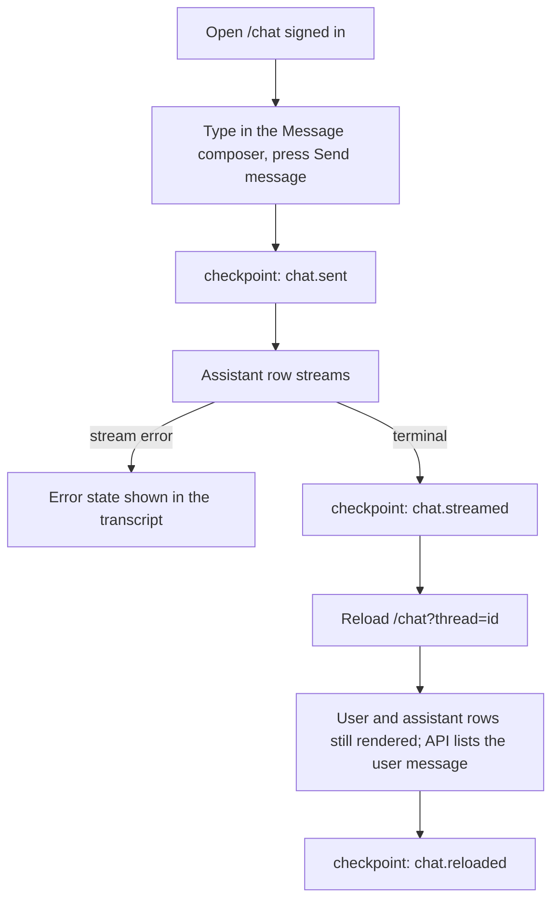

# Flow: chat send, stream, reload persists

States: empty → streaming → done | error. Scenario:
`workflow.reload-persistence` (today it seeds the message through the API; the
composer send path is added with the runner work).

