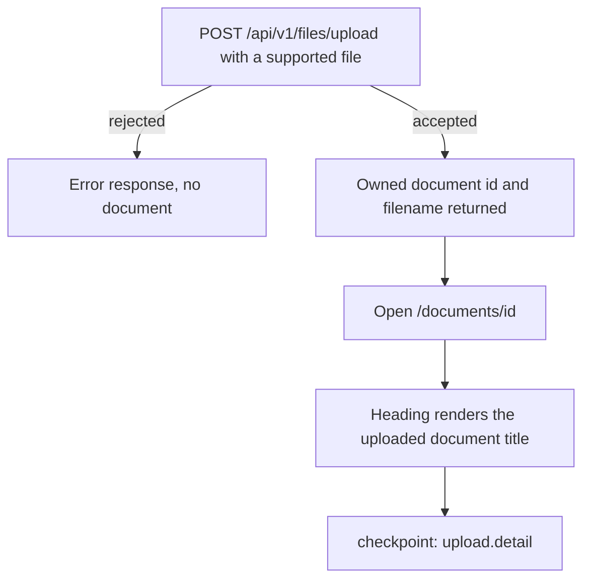

# Flow: document upload and detail

States: empty → loading → done | error. Scenario:
`workflow.document-upload-and-attachment` (API upload, then the detail page in
the browser).

```mermaid
flowchart TD
  A[POST /api/v1/files/upload with a supported file] -->|rejected| E[Error response, no document]
  A -->|accepted| B[Owned document id and filename returned]
  B --> C[Open /documents/id]
  C --> D[Heading renders the uploaded document title]
  D --> F["checkpoint: upload.detail"]
```
