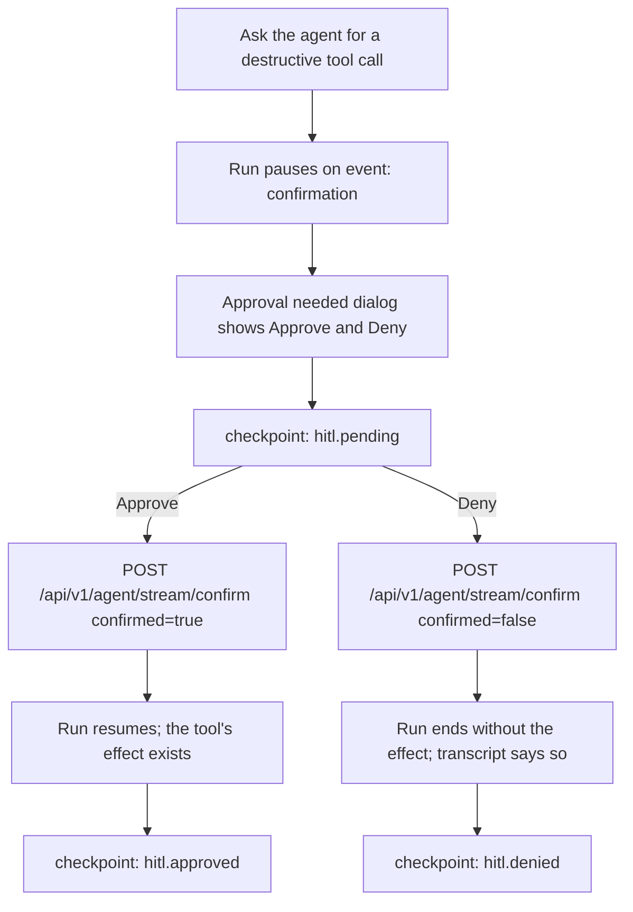

# Flow: HITL approve and deny

States: HITL-pending → done | error. No runnable scenario exists yet;
`adversarial.hitl-synthetic-scope` is a permanent `BLOCKED` placeholder, so
the approve and deny journeys are added with the runner work.

