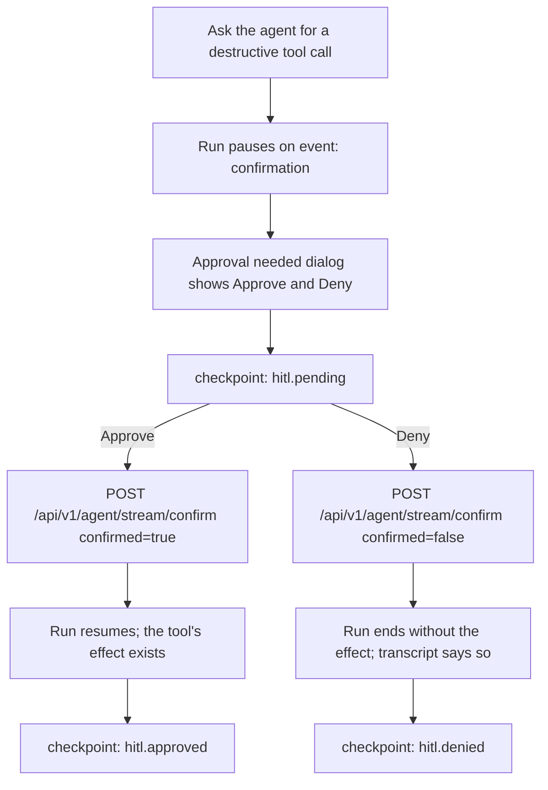

# Flow: HITL approve and deny

States: HITL-pending → done | error. Scenarios:
`workflow.project-creation-via-chat` (Approve, using `create_project` as the
destructive tool) and `workflow.hitl-deny` (Deny). The Approve path's pending
screenshot is `project.pending`; `hitl.pending` is taken on the Deny path.
`adversarial.hitl-synthetic-scope` stays a `BLOCKED` placeholder.
"The transcript says so" is asserted as an assistant row containing
`Action cancelled by user` (the main graph's denial message in
`backend/src/services/agent/_nodes_tools.py`); the `hitl.denied` checkpoint is
the visual confirmation. A denial from a research or writing subgraph may
word it differently; confirm those visually.

