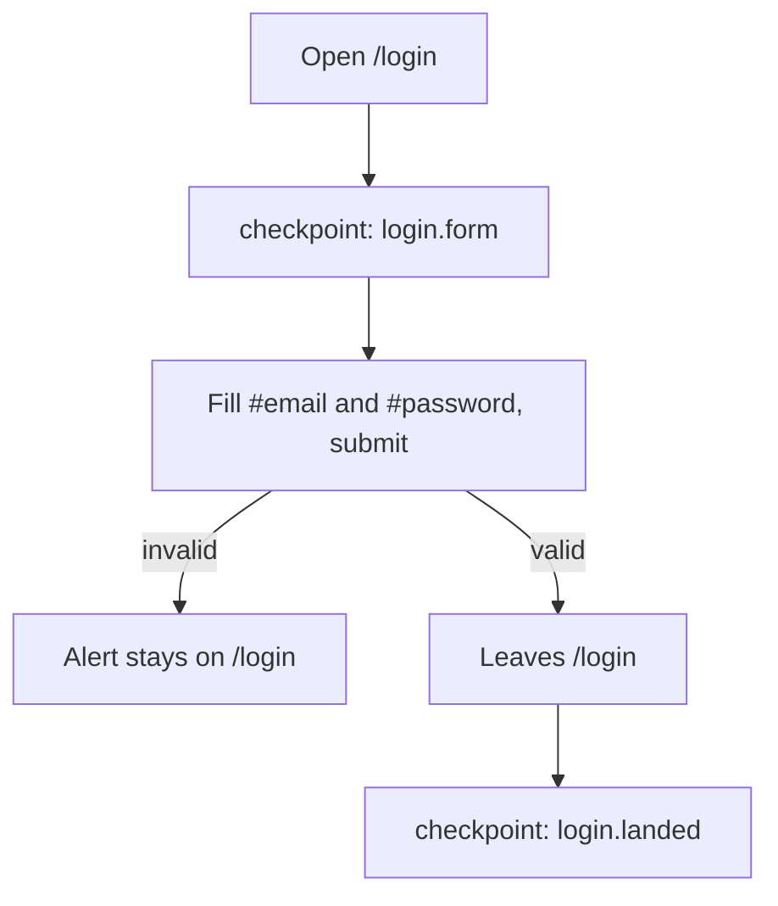

# Flow: login

States: empty → loading → error | done. Scenarios: `smoke.login-availability`
(form), `workflow.login-authenticated` (landing, added with the runner work).

```mermaid
flowchart TD
  A[Open /login] --> B["checkpoint: login.form"]
  B --> C[Fill #email and #password, submit]
  C -->|invalid| E[Alert stays on /login]
  C -->|valid| D[Leaves /login]
  D --> F["checkpoint: login.landed"]
```
