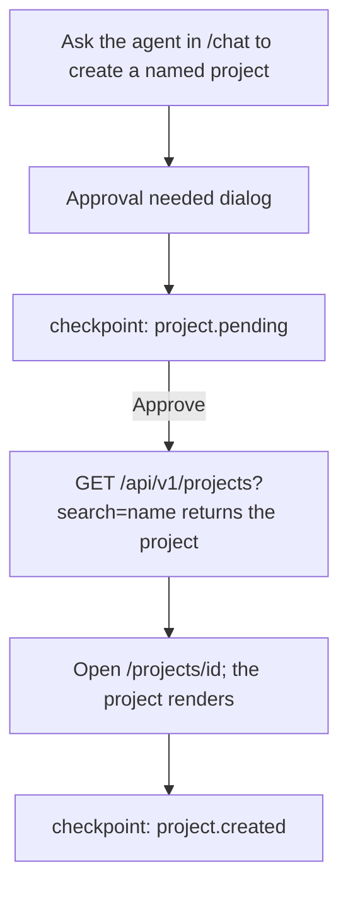

# Flow: project creation via chat

States: HITL-pending → done. `create_project` is a destructive tool, so this
journey always passes through the approval dialog. No scenario exists yet; it
is added with the runner work and cleans up with
`DELETE /api/v1/projects/{id}`.

