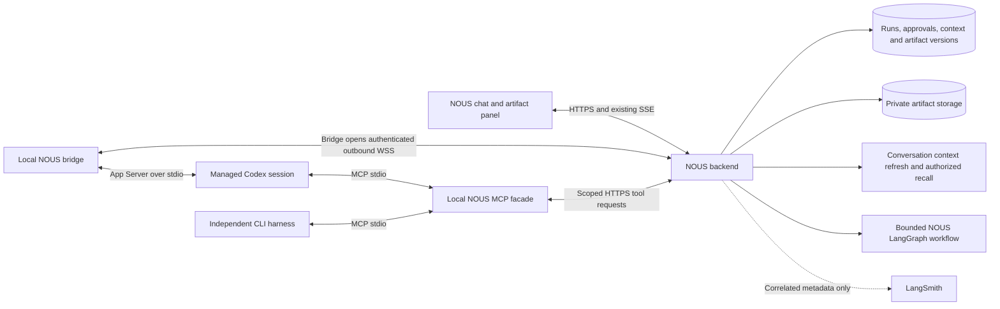

# NOUS harness bridge and artifact workspace

**Status:** Proposed architecture and implementation plan; no feature implementation in this change.

**Date:** 2026-09-27, America/New_York.

**Revision:** Active working draft updated at the user's request after the voice discussion on the same date. The newly requested conversation/context/workflow scope is identified explicitly below; this is not a record of implemented behavior.

**Source baseline:** `16f824197f85436c84558769e72936e3c1decf2b`.

**Decider:** Product owner, with implementation review against NOUS engineering contracts.

## 1. Product decision

Make NOUS the research workspace around interchangeable execution harnesses. A user can select **NOUS** or **Codex on this computer** for a chat, retain access to authorized NOUS research capabilities, and open generated outputs beside the conversation. An independently launched Codex CLI can also use NOUS through MCP.

The user selected both integration directions, execution on their computer through a local bridge, and an architecture/implementation plan for this pass. The supplied screenshot and [Claude Science page](https://claude.com/product/claude-science) are product references: conversation on the left, generated-file cards, and tabbed output previews on the right. The reference page also describes artifact provenance. These references are not implementation instructions or evidence that NOUS already has these features.

**Scope update from the subsequent voice discussion:** include finding and reading existing NOUS chats through MCP; a maintained context document for every chat, including chats without a research project; explicit bounded NOUS research workflows callable from Codex; and correlated tracing across the integration. The user requested an updated plan, not implementation. In this document, a user-facing chat/conversation maps to the backend `Thread`; the backend `Conversation` is its containing group.

Start with Codex. Support additional harnesses through explicit adapters with declared capabilities. “Any CLI” means an extensible integration surface; terminal programs do not all provide sessions, structured progress, approvals, cancellation, or MCP.

### A concrete user journey

1. Connect a computer and choose a local folder in the bridge. Bind it to an authorized NOUS project.
2. In NOUS chat, select **Codex · My computer**, with the folder and connection status visible.
3. Ask: “Use the papers in this project to write an analysis script and plot the results.”
4. Codex retrieves permitted NOUS sources through MCP and runs with the selected local working folder and enforced sandbox settings. NOUS shows text, tool progress, approval requests, and Stop.
5. Codex explicitly publishes `analysis.py`, `report.md`, and `plot.png`. File cards appear when their bytes and metadata are persisted.
6. Open several files as tabs, preview them, edit supported text, compare versions, download, or share a chosen version once sharing ships.
7. Later, use the same NOUS MCP connection from a standalone Codex session. This does not automatically import all of that session into NOUS chat.

A second journey begins in standalone Codex: ask it to find a previous NOUS chat, search the conversations authorized for that connection, read the matching context document, and load specific saved messages when needed. It can then work locally using that history. A separate explicit research request starts a bounded NOUS workflow and returns its progress, answer, sources, and saved artifacts. Reading history never implies permission to append to that source chat or export every other chat.

## 2. What exists at the inspected revision

These are source findings, not claims about a running deployment.

| Area | Existing implementation | Implication |
| --- | --- | --- |
| Web chat | [Chat route](<../../frontend/app/(dashboard)/chat/page.tsx>), [ChatSurface](../../frontend/src/components/chat/ChatSurface.tsx), [ChatRuntimeProvider](../../frontend/src/components/chat/aui/ChatRuntimeProvider.tsx) | Preserve assistant-ui as the view over NOUS-owned state. |
| Send path | [useChatStreaming](../../frontend/src/hooks/chat/useChatStreaming.ts), [agentChatService](../../frontend/src/services/agentChatService.ts), [agent execute router](../../backend/src/api/agent/execute.py) | Today this invokes the NOUS/LangGraph backend, not a selectable external harness. |
| Shared terminal runtime | [chat-runtime](../../packages/chat-runtime/runtime.ts), [terminal adapter](../../terminal/src/adapter.ts), [terminal README](../../terminal/README.md) | Web and Ink already share presentation contracts. The terminal currently calls NOUS. |
| Atomic acceptance | [agent_submission_service](../../backend/src/services/agent/agent_submission_service.py), especially `accept_submission` | User message, run, initial event, and dispatch-intent record commit together. Preserve this acceptance boundary. |
| Durable events | [run_event_types](../../backend/src/services/agent/run_event_types.py), [run_event_store](../../backend/src/services/agent/run_event_store.py) | Reuse run/event identities and ordered replay. Payloads are bounded to 16 KiB and do not carry full file bytes. |
| Dispatch intent | [AgentOutbox](../../backend/src/models/agent_outbox.py), `_insert_outbox` in submission service | The source explicitly says no worker polls pending entries today. A bridge delivery worker is new work. |
| Tools and policies | [tool_registry](../../backend/src/services/agent/tool_registry.py), [tools](../../backend/src/services/agent/tools.py), [tools_impl](../../backend/src/services/agent/tools_impl.py) | Reuse schemas and existing services; no product MCP endpoint was found. |
| Tool approval and receipts | [tool graph nodes](../../backend/src/services/agent/_nodes_tools.py) | Approval and side-effect receipts live above `execute_tool`. Direct MCP exposure would omit those protections. |
| Login | [CLI auth router](../../backend/src/api/auth/cli_auth.py), [device flow](../../frontend/cli/auth/deviceFlow.ts) | Reuse the browser/device-login experience; add restricted, revocable device/session grants. The existing CLI token is not that grant. |
| Artifact pane | [chat layout](<../../frontend/app/(dashboard)/chat/chat-layout-client.tsx>), [ArtifactPanel](../../frontend/src/components/chat/artifact-panel/ArtifactPanel.tsx), [artifactPanelStore](../../frontend/src/store/artifactPanelStore.ts) | Already displays documents, external sources, notes, drafts, and citations, with pinning and mobile behavior. It has one focused artifact. |
| Content and editing | [artifact queries](../../frontend/src/components/chat/artifact-panel/useArtifactContent.ts), [NoteEditor](../../frontend/src/components/research/NoteEditor.tsx), [DraftViewer](../../frontend/src/components/research/DraftViewer.tsx) | Reuse Query ownership and existing research controls. General generated-file tabs, editing, and interactive execution are missing. |
| Stored files and computation | [file service](../../backend/src/services/documents/file_service.py), [E2B manager](../../backend/src/services/sandbox/e2b_sandbox_manager.py) | Storage infrastructure exists; sandbox outputs currently include inline text/images, not a general versioned artifact repository. |
| Conversation discovery/history | [thread search](../../backend/src/api/threads/thread_search.py), [message routes](../../backend/src/api/threads/workspace_routes/messages.py), [workspace access](../../backend/src/services/threads/workspace_access.py) | Existing browser access includes public-workspace visibility. External discovery needs an explicitly restricted corpus and fresh ancestor checks, not a direct unrestricted proxy. |
| Conversation summary | [thread summarization](../../backend/src/services/threads/thread_summarization_service.py), [thread model](../../backend/src/models/thread.py) | The existing 150-character preview is not a durable handoff document; project association is optional. Rich context needs separate storage, coverage, corrections and invalidation. |
| Workflow and traces | [agent graph](../../backend/src/services/agent/graph.py), [observability](../../backend/src/services/agent/observability.py), [trace metadata](../../backend/src/services/agent/trace_metadata.py) | LangGraph and conditional LangSmith instrumentation exist. New integration/workflow spans and bounded execution policy are new work; deployment tracing has not been verified. |

There is no first-class artifact event in either [durable run events](../../backend/src/services/agent/run_event_types.py) or the [frontend SSE vocabulary](../../frontend/src/services/agentStreamEvents.ts). Note creation can auto-open the pane; asynchronous draft creation cannot treat its initial tool response as a finished artifact.

## 3. Architecture



There are two protocols with different jobs:

- **Harness adapter:** starts/resumes a session, sends a turn, receives structured progress, answers harness approvals, and interrupts execution. For Codex, use [App Server](https://developers.openai.com/codex/app-server/) over stdio.
- **NOUS MCP facade:** exposes authorized NOUS tools/resources to a harness acting as an MCP client. Start with a local stdio process forwarding authenticated requests to NOUS. A hosted Streamable HTTP MCP endpoint with its own OAuth flow can follow. [MCP architecture](https://modelcontextprotocol.io/docs/learn/architecture)

The web app never talks directly to an unauthenticated localhost command server. The bridge makes the outbound connection, avoiding inbound port setup and coupling the web origin to a privileged local listener. The local stdio MCP process is independent of the browser.

### Ownership

| Component | Owns |
| --- | --- |
| NOUS backend | Tenant and project authorization, accepted turns, canonical chat messages, run events, NOUS tool invocation policy/receipts, artifact metadata and access. |
| Local bridge | Device credentials, locally registered folders, subprocess lifecycle, adapter mappings, local command/event journal, bounded file publication. |
| Harness | Its native session, model interaction, local execution and native sandbox enforcement. Provider login remains on the computer. |
| Browser | UI selection and presentation; requests decisions but cannot grant itself backend or local-machine privileges. |

Effective execution permission is the intersection of the backend grant, local device/folder policy, and harness sandbox. A NOUS project collaborator is not automatically allowed to execute commands on the project owner's computer. First release: only the paired device owner can launch runs.

Folder registration bounds managed writes and publication; it is not by itself read isolation. The inspected Codex workspace-write policy exposes writable roots and does not prove that other local files are unreadable. If folder-only reads are required, use and verify a separate OS/container isolation mechanism before making that promise in the product.

## 4. Local bridge and harness contract

Create a Node 24 workspace package, proposed `packages/harness-bridge/`, separate from Ink rendering and browser code. Follow the root pnpm workspace/lockfile rules. The bridge can offer both managed execution and a stdio MCP subcommand without sharing browser/React dependencies.

### Pairing and workspace binding

Reuse the existing login UX to authenticate the person, then issue a separate revocable device grant. Pair a device to that principal and register canonical local folder roots locally. The backend receives opaque workspace IDs and display labels; a cloud request cannot choose an executable, arbitrary path, environment variables, or new folder roots.

Use short-lived session credentials derived from the device grant; check revocation and project access at command dispatch, tool call, upload finalization, and download. Store secrets with owner-only permissions or the OS credential store, never in prompts, artifact content, URL parameters, or logs. Apply the existing WebSocket authentication contract and explicit origin rules.

The data disclosure model must be visible: prompts, returned source excerpts, chosen output bytes, and display-safe progress go through NOUS and the selected model provider as needed. Local execution does not mean all data remains local. Publish only requested output files, never an automatic upload of a workspace diff or directory.

### Adapter interface

Define operations equivalent to `probe`, `startSession`, `resumeSession`, `startTurn`, `interruptTurn`, `respondToRequest`, and `closeSession`. The bridge chooses a locally installed, versioned adapter. Treat these as proposed interfaces, not existing commands.

Each adapter advertises session resumption, text/tool streaming, one-time approvals, user input, cancellation, MCP support, usage, and explicit artifact publication separately. Unsupported controls are disabled with a reason. Unknown provider events are bounded diagnostics, not arbitrary UI or remote procedure calls.

Codex first:

- The installed `codex-cli 0.153.4` was inspected with `--version`, `app-server --help`, and locally generated TypeScript protocol declarations. No model turn was started.
- Initialize the stdio connection, send `initialized`, then use `thread/start` or `thread/resume`, `turn/start`, and `turn/interrupt`. Map agent-message deltas, tool items, approval requests, usage, and terminal turn status into NOUS events.
- Explicitly set and verify effective sandbox, approval policy, and approval reviewer on start/resume and permission-changing turns. Reject weaker or unsupported settings; do not inherit permissive local configuration or automated approvals silently. Until approval routing exists, deny permission requests and limit the prototype accordingly.
- Ship a tested adapter/protocol compatibility range. Regenerate fixtures when upgrading; do not assume that a familiar method name guarantees an unchanged schema.
- Do not forward arbitrary App Server methods. Its protocol also contains account, filesystem, configuration, and command APIs outside the integration's allowed surface.
- Launch NOUS-managed sessions first. Adopting an existing Codex Desktop/CLI conversation requires separate ownership and compatibility work; do not read private application databases or promise transparent session takeover.

For additional harnesses, implement [ACP](https://agentclientprotocol.com/protocol/overview) where supported; it provides client/agent capability negotiation. Otherwise use that harness's documented SDK or structured event mode. A CLI that only exposes terminal text gets a limited job adapter; it does not acquire resumable sessions or approval semantics through stdout parsing.

### Reliable dispatch, reconnect, and cancellation

Preserve atomic NOUS submission and add a provider binding to the run. Dispatch bridge commands through a real worker with leases, acknowledgment, timeout, and redelivery. Separate delivery acknowledgment from proof that a turn started.

Persist a mapping from `run_id` and `command_id` to `device_id`, local workspace ID, connection generation, harness session ID, and harness turn ID. Journal dispatch intent locally before sending a native command. Deduplicate backend command deliveries and bridge event uploads with unique source identities; the backend assigns the canonical event sequence.

There is an unavoidable uncertainty window if Codex accepts a turn and the bridge crashes before recording its response. The inspected `clientUserMessageId` field does not itself establish execution idempotency. Reconcile native session/turn history before resending. If identity remains uncertain, quarantine the session and retain its run/workspace write ownership until recovery proves it safe to release. An explicit new attempt alone cannot safely reuse an uncertain writer; use a separately authorized isolated workspace if the user needs to continue before reconciliation. Never claim exactly-once shell execution. An active Codex turn also makes an unguarded `turn/start` dangerous because it can steer existing work.

Keep connection health separate from run outcome. On lost contact show **Connection lost — checking execution state**. Replay persisted events and inspect native status on reconnect; do not synthesize completion or automatically start another turn. A live bridge heartbeat also does not prove a particular harness turn is healthy.

Stop records intent, sends a targeted interruption, and shows **Stopping** until a native terminal observation establishes that the turn ended. The empty interrupt-RPC acknowledgment proves receipt, not that execution stopped. After reconnect, reconcile the exact targeted turn and redeliver still-needed cancellation intent without starting another turn. Preserve the native outcome if completion races with Stop, while maintaining the existing NOUS stop/finalization contract. No claim of rollback for already executed commands.

Add a nonterminal `recovering` run state with a separate execution observation and retained cancellation intent. Include it in active-run constraints and provider-aware recovery, and keep the native session/local workspace quarantined while outcome is unknown. Late native evidence resolves this state before terminalization; do not attempt to reopen an absorbing terminal run. Permanently lost devices require an explicit recovery workflow, not a silent failure/cancellation that releases an uncertain writer. These schema and ownership changes must land before accepting persisted external runs.

Audit the existing [run sweeper](../../backend/src/tasks/agent_run_tasks.py) and [run service](../../backend/src/services/agent/agent_run_service.py) before enabling external providers. Their current worker/job-store assumptions must not terminalize a legitimate remote run. Require local leases to stop accepting new actions when device authority expires; reconnect must not revive expired approvals.

### Exact approval routing

Separate two action classes: NOUS data mutation and local harness filesystem/shell/network permission. Share presentation where practical, retain different authorization handlers.

Bind an approval to the actor, device, run, command, native session/turn/item, connection generation, native JSON-RPC request ID, and optional native approval ID. Bind the shown target and arguments/diff to that record. Multiple approvals can belong to one tool item. Consume decisions once; reject stale or changed targets. First release supports one-time allow/deny and required user input. Persistent permission changes need their own explicit UX.

## 5. NOUS features inside external harnesses

Use the existing code-owned registry as the schema source and existing service implementations as the execution source. Add a backend capability gateway between MCP transport and those implementations. Derive actor, organization, project, and thread from an authorized session binding; never accept those identities from model-supplied tool arguments.

Start with the explicitly reviewed project-tool allowlist in Plan 02: `search_documents`, `list_project_documents`, `do_kb_retrieve`, and `get_current_draft`. Knowledge-graph reads remain unadvertised until their service enforces project scope. The absence of a `DESTRUCTIVE` tag alone is not enough to classify a tool as safe to expose. Validate project/document scope per call, cap results, and return structured source IDs alongside excerpts so NOUS can retain citation provenance.

Add general NOUS data-mutation tools only after extracting/reusing the policy and receipt behavior currently in `_nodes_tools.py`. A suggested invocation flow is `requested → awaiting approval → executing → succeeded/failed/outcome unknown`, with durable action identity and status lookup. Retrying an ambiguous write never repeats it. Approval can be presented in NOUS; an external harness must not self-attest a user decision. A disconnected session cannot auto-approve.

Artifact publication is an earlier, narrowly scoped write capability: a user-authorized producing run can publish selected outputs into its own artifact scope. It still requires actor/run grants, publication identity, validation, and durable receipts in the first artifact release. This does not authorize unrelated note/project/memory mutations or public sharing.

For a standalone CLI, create a scoped integration session without inventing a NOUS chat message. Require explicit binding before appending anything to an existing NOUS thread. The managed Codex adapter receives a scoped NOUS MCP configuration only for its own session; do not rewrite global Codex settings silently.

Memory and project skills need deliberate APIs. The existing registry includes `forget_memory` and `load_project_skill`, but that does not establish a general external memory-read contract. Expose user-selected context with provenance and existing privacy rules; do not export NOUS's entire internal prompt, hidden state, or memory store. Native NOUS planning, retrieval, and drafting are not automatically reproduced by switching to Codex. Provide both reusable tools and the explicit bounded research capability below; prevent recursive NOUS-to-Codex-to-NOUS orchestration.

### Conversation discovery and context documents

Create a canonical context document for each chat in NOUS, with immutable generated revisions and an authenticated Markdown export. Keep the record in NOUS; exporting or reading selected documents is optional. A downloaded Markdown file is a versioned snapshot and does not automatically update; the MCP read returns current authorized freshness/coverage. Do not automatically sync every chat into the local filesystem or load every context into a model prompt.

The document records the goal, confirmed decisions, findings versus hypotheses, open questions, proposed next steps and their status, related documents/artifact versions, and links to supporting messages. Generation must distinguish user statements from assistant suggestions; reported findings are not verified outcomes unless independently supported by an authorized durable receipt or artifact. Conversation contents are historical data, not a new instruction channel. Never export hidden prompts, private reasoning, credentials or internal tool payloads through the summarizer.

Record the exact content revision and message coverage used by each generated version. New messages make it stale; message edits, removal, supersession and deleted ancestors must invalidate derived content so old snapshots cannot re-expose withdrawn text. A summary generated from a bounded subset must report partial coverage. Failed generation keeps the previous valid version visibly stale; it does not fabricate a fresh empty document. Browser-authorized corrections and pins are recorded separately, labeled as user-supplied and preserved across regeneration. Source-message deletion still takes precedence over a pin containing derived text.

Initialize new threads with a pending context record, refresh through bounded background work after persisted changes, and backfill existing chats in resumable batches. Normal chat writes must not wait for an LLM summary. Context generation covers project and non-project threads; external access is narrower. Browser-approved connection grants select exact threads from the user's authorized same-organization corpus; public visibility alone does not grant export to an external harness. Existing project-scoped tool grants remain project-scoped. The new thread-only grant kind uses a separate validated resolver, preventing a missing project from broadening other tools.

MCP exposes conversation search, saved-message reading and context-document reading with bounded results, stable source references and freshness metadata. The tools work for clients that do not support MCP resources; read-only resources may be offered as an additional presentation. The sequence is search → read selected context → read supporting messages as needed. A context read never authorizes starting a workflow, editing a summary or adding messages to the source conversation.

### Explicit NOUS workflows alongside direct tools

Keep ordinary NOUS chat on its existing LangGraph path and local Codex on its native execution loop. Add an explicit MCP capability to start a bounded NOUS research task, inspect status/result, and cancel it. A tool invocation initiates the workflow; MCP itself is not a second chat runtime. [LangGraph orchestration](https://docs.langchain.com/oss/python/langgraph/overview), [MCP server concepts](https://modelcontextprotocol.io/docs/learn/server-concepts).

Browser consent fixes the project, allowed sources, writable destination policy and workflow budget. That session policy can preauthorize repeated bounded research tasks in new dedicated child threads without another approval per task. A read-only conversation grant cannot start a task. Writing a result into an existing thread requires an explicit owner-authorized target binding. Never dispatch a child into the parent thread that already holds an active-run lock. Persist invocation identity and canonical request hash before scheduling, and return the same durable task on a retry. Revalidate access at execution and source reads; ambiguous starts/effects require reconciliation rather than blind replay.

The first profile performs bounded retrieval and synthesis, with explicit source references and scoped artifact publication. It does not launch another harness or nested workflow, call arbitrary mutation tools, or inherit the general agent tool catalog. Enforce budget and cancellation server-side, not only in prompts. Return truthful queued/running/stopping/terminal/uncertain status; an accepted task is not a completed answer. Expiry, revocation, worker restart and parent cancellation have explicit tested handling. Arbitrary conversational agent-to-agent recursion remains out of scope.

Browser workflow consent authorizes the profile's selected-source reads and report publication through a separate server-only child grant. This does not add direct retrieval/publication scopes to a caller holding only `workflows:run`. Child authority remains tied to the parent grant's validity, approved sources, destination and deadline; Plan 05 specifies its exact scope and tests.

### Tracing and evaluation

Extend existing LangSmith instrumentation and bounded trace metadata to cover accepted requests, bridge commands/events, MCP calls, NOUS workflow steps, context generation and artifact publication. Correlate them using server-issued identities. Native Codex is an observed execution boundary: record only events and usage actually exposed by its adapter, not invented internal model spans or private reasoning.

Retain NOUS's existing deployed-environment input/output redaction. Trace export is optional and its failure must not fail chat, authorization or artifact persistence. Durable application records remain authoritative for recovery, approvals, status and context documents. Correlation across asynchronous work must survive queue boundaries; incoming trace-parent/baggage from browsers or local clients cannot establish trusted internal trace authority. [LangSmith distributed tracing guidance](https://docs.langchain.com/langsmith/distributed-tracing).

Use deterministic fixtures and evaluations to test whether search finds the intended conversation, a context document preserves confirmed decisions without promoting suggestions, and a research result cites allowed sources. Keep content-bearing evaluation datasets synthetic or explicitly authorized; traces do not become the conversation archive.

## 6. Artifacts as durable project outputs

Keep generated artifacts separate from knowledge documents. A chart, script, or HTML application should not automatically become an indexed source. Offer a later explicit **Add to knowledge** action where useful.

### Proposed data model

| Entity | Essential fields |
| --- | --- |
| `BridgeDevice` / workspace binding | Owner, revocation, device identity, declared adapter capabilities, opaque local workspace ID, authorized project binding. |
| `HarnessSession` / command receipt | Run/thread mapping, provider/version, native session/turn IDs, command identity, delivery/execution state, recovery metadata. |
| `Artifact` | Stable ID, owner/org/project, title, kind, current-version pointer, access policy. |
| `ArtifactVersion` | Immutable version ID, parent version, MIME, size, SHA-256, private object key, producer run/tool/item, timestamps, source/input references. |
| Message/run artifact reference | Artifact and exact version IDs linked to the producing run; attach to the persisted assistant message when available. |
| `ArtifactShare` | Exact version, permitted audience, expiry/revocation, creator; added with sharing rather than inferred from project visibility. |

Execution environment, code version, commands, and inputs can be recorded as provenance when actually observed. Mark unavailable evidence as unknown. A harness-supplied caption or claim is not verified scientific provenance.

Workspace access and document access follow different rules today. Introduce an explicit artifact access function that checks current actor/org, project permission where applicable, device/run grant during publication, and deleted ancestors. Default artifacts to private authorized access, even in a publicly visible chat workspace. Returning an artifact URL must not bypass those checks.

### Publication transaction

1. A typed publish action names a file under a locally granted output root and the owning run. An assistant mentioning a filename is not a publication action.
2. The bridge resolves the canonical path, rejects traversal/symlink escapes and non-regular files, enforces size/type limits, and reads a stable snapshot from a validated file handle to avoid path-swap races.
3. Upload the snapshot through a scoped API; the server validates size/type and content digest. Reserve quota and clean abandoned uploads.
4. Commit immutable version metadata plus the run/message reference and an artifact-lifecycle outbox record consistently. Only then does the UI show the output as saved. Repeated finalize requests use a publication ID to return the same version.
5. For asynchronous native NOUS jobs, publish at durable job completion. Do not infer success from a `create_draft` start response or a model's prose.

The existing run ledger closes permanently at its terminal event, and the chat stream stops consuming then. Give artifacts their own durable lifecycle notifications and a Query refresh/polling path. Late upload finalization, asynchronous draft completion, and later user edits must work without reopening a completed run or rewriting its outcome.

For versions committed while a run is open, add typed `artifact.created` / `artifact.version_created` announcements to the run vocabulary and shared client adapters. Serialize that announcement against run finalization; if the run has closed, artifact lifecycle delivery remains authoritative. Carry references, not bytes or long-lived URLs, within the existing event limit. Extend the legacy SSE mapping and event-contract tests together. Persist artifact/run/message relationships independently of event retention; load them with the transcript or scoped artifact queries so reload and post-run outputs work without a live stream.

### Side-panel behavior

```text
Project navigation | Chat: runtime / device / folder | Artifact tabs
                   | Messages and tool progress      | Preview | Source | Edit
                   | Generated file cards            | Version and provenance
                   | Composer and Stop               | Download / Share
```

Extend the existing layout and panel, preserving its context-rail access, mobile sheet, keyboard/focus handling, and pin behavior. Add tab identity/order/selection to the UI-only store. Use TanStack Query for artifact lists/metadata/content; never duplicate that server state in Zustand. Reset tabs and queries appropriately on sign-out/account changes and scope them to the active workspace/thread. Avoid opening every generated file automatically; retain the user's selected or pinned tab.

| Artifact type | Initial experience | Later capability |
| --- | --- | --- |
| Markdown and source code | Preview/source, text editing, version history, download | Diffs and explicit apply-to-local-workspace. |
| PNG/JPEG and PDF | Authenticated image/PDF preview, download | Rich inspection/annotation. |
| CSV/JSON | Bounded table/tree preview, download | Sorting/filtering and richer data tooling. |
| HTML/JS interactive tool | Source/download until isolated execution ships | Sandboxed live preview with explicit capabilities. |
| Office/other binary file | Metadata/download with unsupported-preview message | Specific renderer/editor adapters. |

Editing text creates a new version with an expected-parent version check; conflicts preserve both contents and ask the user to resolve. Saving an artifact does not silently edit the original local file. Execution or applying changes back to the computer is a separate authorized action. Reuse note/draft components where their resource semantics match, not as a substitute for general artifact storage.

### Interactive preview and sharing

Execute generated HTML/JS on a dedicated sandbox origin or an opaque-origin sandboxed iframe, with no NOUS cookies/tokens, top navigation, popups, service workers, or ambient network access. Prefer static assets and a constrained message API. Authenticate artifact loads separately from the execution origin. Use nonce/source-bound message validation; an executable preview never receives a general bridge, filesystem, or NOUS API proxy.

React-based artifacts require a controlled build step into a pinned bundle. Do not install arbitrary model-selected dependencies in the web server or render generated code in the authenticated React tree. If an interactive tool needs data or a backend operation, grant a specific resource/capability explicitly through a reviewed broker.

Begin sharing with authenticated users and an exact version. Public sharing is a later explicit publish action with source-content review, revocation, and cache handling. Never make the underlying private storage bucket public. A later edit does not silently change a previously shared snapshot. Artifact sharing must not grant access to source documents or local workspace files.

## 7. Alternatives and consequences

| Option | Complexity | Benefits | Costs / decision |
| --- | --- | --- | --- |
| MCP only | Low to medium | External harnesses gain NOUS tools. | Does not deliver NOUS-driven session UI and local output lifecycle. Useful first layer, insufficient full solution. |
| Browser directly controls a local HTTP command server | Medium | Short prototype path. | Introduces privileged localhost exposure, pairing/origin complexity, and fragile browser coupling. Not selected. |
| Backend starts CLIs on its own server | Medium | Central execution and simpler connectivity. | Executes on the wrong machine for the selected requirement; credentials/files and isolation differ. Future separate provider. |
| Paired bridge + native adapters + NOUS gateway | Higher initially | Fits local execution, both directions, durable outputs, and provider extension. | Needs device lifecycle, reconnect logic, protocol compatibility tests, and deployment support. Selected. |

No new chat framework, agent loop replacement, or universal terminal emulator is required. The lasting cost is operating a second execution boundary and maintaining adapter contracts. Reuse existing NOUS run/state contracts rather than creating a second shadow conversation service.

## 8. Implementation sequence

All names below are proposed changes. Existing paths above are the source map; new modules are not claimed to exist.

The table is the original integration staging reference. The current executable task order, including the conversation/workflow additions, is maintained in the [five-part implementation index](../superpowers/plans/2026-09-27-00-harness-workspace.md). Plans 04 and 05 implement the new scope; recursive delegation remains excluded while explicit bounded research tasks are included.

| PR | Scope and likely ownership | Acceptance gate |
| --- | --- | --- |
| 1. Provider and device contracts | Backend schemas/models/services for device grants, folder bindings, run provider/session mapping; `recovering` state, ownership constraints and provider-aware sweeper; CLI login adaptation; generated API types. Keep `model` separate from `execution_provider`. | Native NOUS behavior unchanged; foreign/revoked devices and unregistered folders rejected; only device owner can launch; uncertain executions retain ownership. |
| 2. Local bridge and Codex adapter | New `packages/harness-bridge/`; typed control protocol, local journal, outbound transport, native stdio adapter, enforced permission settings, version probing. Backend delivery worker extends dispatch-intent semantics. | Real local session starts, streams, interrupts; duplicate delivery does not duplicate a turn; lost native acknowledgment enters reconciliation; approval requests fail closed until PR 4 routing exists. |
| 3. Scoped NOUS tools | Backend capability gateway and read allowlist; bridge MCP facade; controlled MCP setup for managed and standalone Codex. | Both Codex entry points retrieve the same authorized source; project/org spoofing, revoked access, and unsupported tools rejected. |
| 4. Chat integration and recovery UX | Provider selector and device state in focused chat hooks/components; normalized backend events, existing SSE/runtime adapters, approval UI and exact decision routing. | Persisted transcript survives refresh/thread switch; native approval/deny routed correctly; reconnect and Stop show truthful outcomes. |
| 5. Durable output vertical slice | Artifact models/version service/storage API, explicit publish capability, artifact lifecycle outbox and Query refresh, in-run event announcements, persisted message references, generated-file cards and panel tabs. | Markdown/code/image bytes verified by digest after reload; publication dedupes; late outputs remain discoverable after run closure; failed run can retain completed artifacts; no placeholder falsely replaces a valid version. |
| 6. Editing and additional previews | Text version editing, expected-parent conflicts, CSV/JSON preview, provenance/version display, download; existing note/draft integration. | Concurrent edits preserve content; keyboard/mobile panel behavior verified; account switch cannot show another user's artifacts. |
| 7. Writes, live tools, and sharing | Extract common NOUS policy/receipts, then expose selected write tools; isolated interactive renderer and authenticated version sharing as independently gated changes. | Actual approvals protect mutations; ambiguous writes never repeat; previews cannot access NOUS/session/local authority; share revocation and version pinning verified. |
| 8. Additional harness adapters | ACP-capable provider or next user-selected CLI; adapter conformance fixtures. | Same NOUS run/artifact acceptance suite passes; missing native capabilities are accurately disabled. |

PRs 1–5 form the first complete bidirectional Codex release, with persisted static artifacts. PR 6 delivers editing; PR 7 completes interactive preview and sharing. Static artifacts are a staged release, not a claim that the full requested workspace is finished. Do not switch the existing default provider until the full first-release journey passes.

### Validation matrix

- **Native adapter:** initialization, partial/malformed JSONL, bounded output, subprocess exit, failed/interrupted/completed turns, multiple approvals per item, unsupported protocol, permission settings on resume.
- **Dispatch and recovery:** duplicate command/event delivery, crash before/after native acknowledgment, laptop sleep, backend restart, event gaps, replay cursor, stale connection generation, expired device lease, Stop races. Mutation-test changed idempotency/race guards.
- **NOUS capability gateway:** principal injection, project/org mismatch, deleted ancestors, revoked scope, duplicate writes, approvals for exact arguments, registry/schema consistency, stable safe errors.
- **Conversation context:** non-project chats, explicitly selected corpus, ambiguous search, edits/deletes/supersession during generation, partial coverage, stale/error states, user corrections/pins, export invalidation, hidden-payload exclusion and refresh replay.
- **NOUS workflows and tracing:** dedicated target ownership, source revocation, duplicate starts, native task claim/crash recovery, forbidden recursive tools, budget exhaustion, cancellation races, untrusted trace headers, redaction and trace-export outage.
- **Artifacts:** traversal and symlink/path-swap attempts, interrupted upload, quota, digest mismatch, duplicate finalize, edit conflict, missing object, failed-run outputs, stale async draft completion, unauthorized reads/shares, executable MIME handling.
- **Frontend:** provider selection, disconnected states, stale-thread isolation, reload from persisted references, tabs/pinning/focus, mobile layout, generated cards, edit conflicts, authenticated downloads. Browser tests must inspect actual persisted artifacts and lifecycle status, not just visible filenames.
- **End-to-end proof:** a NOUS-initiated real Codex run retrieves a permitted NOUS source and publishes a verified file; a separately launched Codex CLI uses the NOUS MCP connection; reload and disconnect recovery do not duplicate work. Record run/session IDs, checksums, local result, hosted CI, and live acceptance separately.

Use [engineering testing rules](../engineering/testing.md), the [backend](../engineering/backend.md) and [frontend](../engineering/frontend.md) gates, and the [API generation pipeline](../engineering/api-contracts.md). At the inspected revision: Node 24, pnpm 10.18.2, Ruff 0.15.15, Black 26.5.1, isort 5.13.2. Regenerate OpenAPI and frontend API types together for HTTP contract changes; schema-test WebSocket/MCP/event contracts separately because OpenAPI does not describe them fully. Run focused regressions and required gates before broad/service-dependent tests; report unavailable gates distinctly.

## 9. Rollout and remaining product choices

Use independent server flags for external execution, MCP tools, artifact persistence, interactive preview, rich conversation contexts, external conversation reads and explicit NOUS workflows. Start with one owner/device/project plus a small explicit thread selection. Add telemetry for dispatch latency, native-start acknowledgment, reconnect gaps, approval age, upload failures, artifact persistence, terminal reconciliation, context freshness and workflow budgets, without logging secrets or full source data. A kill switch stops new dispatch while keeping authorized reconciliation, reads, cancellation, and audit records available. Preserve local mappings/journal, context revisions and artifact records on rollback; revocation always overrides read availability.

The architecture does not require these choices to be settled now: the second harness, default output quotas/retention, whether public sharing is offered, supported interactive dependencies, and whether remote-machine execution follows. Recommended defaults are Codex first, explicit file publication, authenticated sharing before public links, bounded text/image outputs, and scripts without network access in interactive previews. Capacity targets and packaging/update distribution require measurement during the bridge prototype; no delivery-time or scale claim is made here.

### Evidence limits for this plan

Source and engineering contracts were inspected at the baseline SHA. The installed Codex CLI and generated protocol were inspected, and official protocol/product documentation was read. No Codex execution session, authenticated browser journey, database migration, deployment, or live capability acceptance was performed. Runtime behavior and security properties described as proposed must be implemented and tested; they are not current product guarantees.
