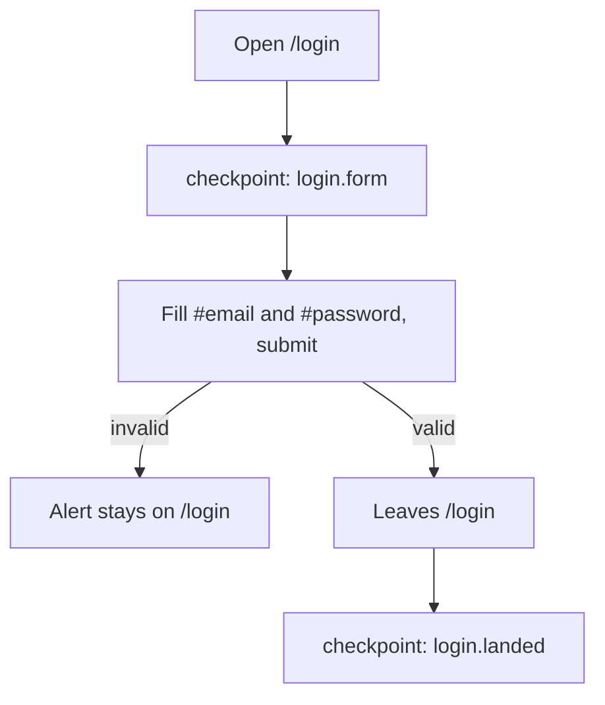
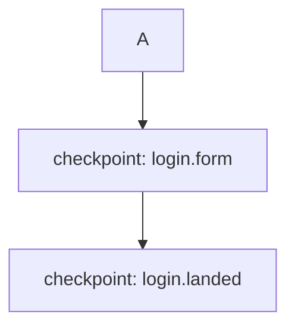

# nous-verify Implementation Plan

> **For Claude:** REQUIRED SUB-SKILL: Use superpowers:executing-plans to implement this plan task-by-task.

**Goal:** Turn the approved design in [2026-10-08-nous-verify-design.md](2026-10-08-nous-verify-design.md) into a user-level verification gate: a feature map that selects `tests/e2e/qa` scenarios from a diff, checkpoint screenshots + video + trace as proof, a committed evidence README, a feature-map upkeep CI check, and a `nous-loop.md` stop gate with a thin skill adapter.

**Architecture:** Everything builds on the existing NOUS QA CLI (`scripts/nous-qa.mjs` → `tests/e2e/qa/{cli,runner,session,scenarios,report}.mjs`). New pure modules (`tests/e2e/qa/feature-map.mjs`, `tests/e2e/qa/evidence.mjs`) feed the CLI; `session.mjs` grows video/trace/checkpoint support; the runner exposes `evidence.checkpoint(name)` to scenarios. A stdlib+PyYAML script `scripts/ci/check_feature_map.py` keeps `docs/engineering/feature-map.yaml`, `docs/engineering/flows/*.md` and `scenarios.mjs` consistent and is wired into the always-on `lightweight-checks` CI job and `scripts/ci/run_local_ci.sh`. `docs/engineering/verification.md` is the canonical contract; `nous-loop.md` step 7b and `.claude/skills/nous-verify/SKILL.md` point at it.

**Tech Stack:** Node 24 ESM `.mjs` + `node:test` (`node --test`, the runner the existing `tests/unit/scripts/nous-qa.test.mjs` already uses), Playwright (`playwright` ^1.47 in `tests/e2e`), `yaml` (new devDependency of `tests/e2e`, pure JS), Python 3.11 + PyYAML + pytest (`backend/pytest.ini`, marker `unit`), bash.

---

## Facts checked against the real code (read before starting)

- `pnpm qa:nous` = `node scripts/nous-qa.mjs` → `tests/e2e/qa/cli.mjs#main`. Selection today is `--suite` + repeatable `--scenario ID`; `runner.mjs#selectionError` rejects any selected id outside the chosen suite, so `--features` must force `suite: 'all'`.
- `session.mjs#openBrowser` (lines 268-300) launches one Chromium and one context: `browser.newContext({ baseURL, storageState? })`. Video must be configured at `newContext` time and tracing started on the context, so the evidence directory must be in `config` before the browser opens.
- `runner.mjs#runCampaign` builds the `evidence` object per scenario (lines ~300-330: `runId`, `fixturePrefix`, `record`, `identity`, `reserveModelTurn`, `consumeModelTurn`). `checkpoint(name)` is added there.
- `report.mjs#CASE_STATUSES` = `PASS | FAIL | BLOCKED | SKIPPED`; exit codes: `1` on any FAIL, `2` on blocked/skipped/incomplete/invalid/no selection. "NOT RUN" is not a case status — the contract maps `BLOCKED`/`SKIPPED`/exit 2 to `NOT RUN`/`BLOCKED` at the reporting layer.
- Existing scenario ids relevant to v1 (`tests/e2e/qa/scenarios.mjs`): `smoke.login-availability` (line 255, browser, no auth), `workflow.reload-persistence` (line 455, seeds the message via `POST /api/v2/messages`, then browser reload), `workflow.document-upload-and-attachment` (line 707, API-only `POST /api/v1/files/upload`, no browser), `adversarial.hitl-synthetic-scope` (line 1004, a permanent `BLOCKED` placeholder — not a runnable HITL test). There is **no** UI-send scenario, **no** HITL approve/deny scenario and **no** project-creation scenario.
- HITL: `create_project` carries `ToolPolicyTag.DESTRUCTIVE` (`backend/src/services/agent/tools.py` ~line 606), so "project creation via chat" **is** the HITL journey. The SSE stream emits `event: confirmation` with `{thread_id, confirmation, run_id}` (`streaming.py` ~2987). The web UI resolves it with `POST /api/v1/agent/stream/confirm` `{thread_id, confirmed}` (`frontend/src/services/agentChatService.ts` line 952); `POST /api/v1/agent/confirm/{job_id}` also exists for the job API. The approval UI is `role="alertdialog"` `aria-label="Approval needed"` with buttons named `Approve` and `Deny` (`frontend/src/components/chat/aui/HitlApprovalToolUI.tsx`).
- Chat composer: `page.getByRole('textbox', { name: 'Message', exact: true })`; send control `aria-label="Send message"` (`frontend/src/components/chat/shared/SearchComposer.tsx` line 94). Transcript rows: `[data-role="user"], [data-role="assistant"]` (`scenarios.mjs#assertTranscriptContains`).
- Cleanup routes (`session.mjs#cleanup` ~line 930) know `workspace|conversation|thread|document|collection` only. Projects need `project: /api/v1/projects/{id}` (`DELETE` exists, `backend/src/api/research/projects.py` line 280; list supports `?search=`).
- `tests/unit/scripts/nous-qa.test.mjs` (50 tests, `node:test`) passes today (`node --test tests/unit/scripts/nous-qa.test.mjs`) but is **not run by any CI job or by `run_local_ci.sh`** (both only run `pytest tests/unit/scripts/`). PR2 wires it.
- `.nous-qa-reports/` is **not** gitignored today; `.verify-artifacts/` must be added explicitly. `backend/tests/unit/ci/test_gitignore_contract.py` is the pattern for an ignore test.
- `.github/workflows/test-pipeline.yml` job `lightweight-checks` (line 73) always runs (`needs: ci-plan`, no `if`), installs `pytest pytest-cov PyYAML`, runs `scripts/docs/check_dir_docs.py` then two pytest steps. No Node there. `frontend-tests` (line 739) has Node + pnpm but only runs when `ci-plan` selects frontend.
- `tests/unit/scripts/test_nous_loop_contract.py` constrains `docs/engineering/nous-loop.md`: no `Claude|Codex|Fable|Opus|ScheduleWakeup|pr-review-toolkit`, no `20dd-dd-dd` dates, and the only lines matching `^- \`x\` —` must be exactly `merged`, `ready-for-human`, `dry`. `.claude/commands/nous-loop.md` must stay ≤ 60 lines. Keep both true in PR3.
- No `.claude/skills/` directory exists in the repo (only `.claude/commands/nous-loop.md`). Skill format reference: `~/.claude/skills/nous-merge-loop/SKILL.md` (YAML frontmatter `name`, `description`).
- Backend routers: 100 files under `backend/src/api/**` contain `APIRouter(` (incl. `README.md` — exclude non-`.py`). Frontend: 42 `frontend/app/**/page.tsx`. The v1 map claims a handful; everything else goes on the shrink-only ignore list.
- Python: `backend/.venv` (fallback `/Users/goodwiinz/development/RAG_system/backend/.venv`), PyYAML 6.0.3 present. Pinned linters: `ruff==0.15.15 black==26.5.1 isort==5.13.2 mypy==1.7.1`. Added `.py` files get mypy `--disallow-untyped-defs`-style checking in CI: type every def.
- Local machine Node is v22.23.1 (repo pins 24.x). `node --test` and `path.matchesGlob` both exist on 22+, but the plan uses its own glob→RegExp to match Python `fnmatch` semantics exactly.

Live-service honesty: every scenario run needs a reachable frontend+backend and `NOUS_QA_EMAIL`/`NOUS_QA_PASSWORD` (plus `--allow-writes` for write/model cases). Without them the CLI reports `BLOCKED` and exits 2. Every task below that says "NOT RUN" must be reported exactly that way, never as passing.

Commit footer for every commit in this plan (blank line, then):

```
Co-Authored-By: Claude Opus 5.5 <noreply@anthropic.com>
```

---

# PR1 — Contract, feature map, flow charts, `check_feature_map.py`

Branch: `feat/nous-verify-pr1-contract` from `origin/develop`.

### Task 1.1: Canonical contract `docs/engineering/verification.md` + contract test

**Files:**
- Create: `docs/engineering/verification.md`
- Modify: `docs/engineering/README.md` (add bullet after the `nous-loop.md` bullet, ~line 39)
- Create: `tests/unit/scripts/test_nous_verify_contract.py`

**Step 1: Write the failing test**

```python
"""Static contracts for the user-level verification gate (nous-verify)."""

from __future__ import annotations

import re
from pathlib import Path

import pytest

pytestmark = pytest.mark.unit

REPO_ROOT = Path(__file__).resolve().parents[3]
CONTRACT = REPO_ROOT / "docs" / "engineering" / "verification.md"
FEATURE_MAP = REPO_ROOT / "docs" / "engineering" / "feature-map.yaml"
FLOWS = REPO_ROOT / "docs" / "engineering" / "flows"


def test_verification_contract_is_canonical_and_discoverable() -> None:
    text = CONTRACT.read_text(encoding="utf-8")
    index = (REPO_ROOT / "docs" / "engineering" / "README.md").read_text(
        encoding="utf-8"
    )

    assert text.startswith("# User-level verification (nous-verify)\n")
    assert "[verification.md](verification.md)" in index
    for result in ("`PASS`", "`FAILED`", "`BLOCKED`", "`NOT RUN`"):
        assert result in text
    assert "docs/engineering/feature-map.yaml" in text
    assert "docs/engineering/flows/" in text
    assert "scripts/ci/check_feature_map.py" in text
    assert "docs/testing/evidence/verify-" in text
    assert ".verify-artifacts/" in text


def test_verification_contract_is_runtime_neutral() -> None:
    text = CONTRACT.read_text(encoding="utf-8")
    for term in ("Claude", "Codex", "Fable", "Opus"):
        assert not re.search(rf"\b{term}\b", text)


def test_feature_map_and_flows_exist_for_v1_features() -> None:
    assert FEATURE_MAP.is_file()
    for feature in (
        "login",
        "chat-send-stream-reload",
        "hitl-approve-deny",
        "document-upload",
        "project-creation-via-chat",
    ):
        assert (FLOWS / f"{feature}.md").is_file(), feature
```

**Step 2: Run it — expected FAIL**

```sh
backend/.venv/bin/python -m pytest tests/unit/scripts/test_nous_verify_contract.py --confcutdir=tests/unit/scripts -q -p no:cacheprovider --no-cov
```
Expected: `FileNotFoundError` on `verification.md` (3 failed).

**Step 3: Write the contract**

`docs/engineering/verification.md` (keep runtime-neutral, no model names, no dates in prose):

```markdown
# User-level verification (nous-verify)

Canonical contract for proving a change works as a user would experience it.
Unit and CI gates stay as they are; this gate adds end-to-end proof selected
from the diff, with visual evidence a reviewer can inspect.

## Vocabulary

- `PASS` — every selected scenario passed, cleanup completed, and the operator
  viewed every checkpoint screenshot and confirmed the feature's pass criteria.
- `FAILED` — at least one selected scenario failed an assertion, or a checkpoint
  contradicts a pass criterion even though assertions passed.
- `BLOCKED` — a required prerequisite was unavailable: credentials
  (`NOUS_QA_EMAIL`/`NOUS_QA_PASSWORD` or `--storage-state`), `--allow-writes`,
  a reachable target, or a deployment identity that did not match.
- `NOT RUN` — the gate was not executed for this change (no mapped feature, or
  the operator could not boot or reach any target).

A `PASS` never comes from assertions alone. Missing credentials, a skipped
case, or an exit code of `2` from `pnpm qa:nous` is `BLOCKED` or `NOT RUN`.

## Artifacts

| Artifact | Location | Committed |
| --- | --- | --- |
| Feature map | `docs/engineering/feature-map.yaml` | yes |
| Flow charts | `docs/engineering/flows/<feature>.md` | yes |
| Checkpoint PNGs, video, trace, JSON/HTML reports | `.verify-artifacts/<run-id>/` | no (gitignored; upload as CI/PR artifact) |
| Evidence record | `docs/testing/evidence/verify-<feature>-<YYYYMMDD>/README.md` | yes |

## Feature map

One entry per feature: `id`, `status` (`planned` or `covered`), `surfaces`
(`web` routes, `api` endpoints, `cli` commands), `states`, `pass_criteria`,
`scenarios` (ids from `tests/e2e/qa/scenarios.mjs`), `owns` (path globs,
`fnmatch` semantics: `*` also crosses `/`). `ignore.pages` and
`ignore.routers` list unclaimed `frontend/app/**/page.tsx` and
`backend/src/api/**/*.py` routers; the lists only shrink.

`scripts/ci/check_feature_map.py` fails when a mapped scenario id does not
exist, a `covered` feature's flow checkpoint has no `checkpoint('<name>')`
call, a page or router is neither claimed nor ignored, or an ignore entry is
stale or also claimed. It runs in the hosted Lightweight Checks job and in
`scripts/ci/run_local_ci.sh`.

## Flow charts

Each `docs/engineering/flows/<feature>.md` holds one Mermaid chart. A node
whose label is `checkpoint: <name>` names a screenshot that the mapped
scenario must take with `evidence.checkpoint('<name>')`. Names are
`feature.step` in lower-case letters, digits, dots and hyphens.

## Running

```sh
scripts/verify/boot_local.sh start        # local backend + frontend, waits for health
pnpm qa:nous --features login,chat-send-stream-reload --allow-writes \
  --base-url http://127.0.0.1:3000 --api-url http://127.0.0.1:8000/api/v1 \
  --evidence-dir .verify-artifacts/<run-id> \
  --evidence-record docs/testing/evidence/verify-<feature>-<YYYYMMDD>
pnpm qa:nous --changed-from origin/develop ...   # select features from the diff
scripts/verify/boot_local.sh stop
```

Against the deployed lane, replace the URLs with `https://goodwiinz.tech` and
`https://dev-api.goodwiinz.tech/api/v1` and add `--expected-backend-sha <sha>`
(with `--deployment-evidence` when the server exposes no identity).

## Evidence record

The committed README lists the source SHA and dirty state, the target URLs,
the command, each scenario's result and reason, and every checkpoint name
with its artifact file name. It links no binary. Add the bundle to the table
in `docs/testing/evidence/README.md`.

## Stop gate

`docs/engineering/nous-loop.md` step 7b requires a local `PASS` for every
mapped feature the diff touches before an outcome of `merged`; `BLOCKED` or
`NOT RUN` ends the tick as `ready-for-human`. Step 8 reruns the same
features against the deployed lane after deployment and files a regression
on failure.
```

Add to `docs/engineering/README.md` after the `nous-loop.md` bullet:

```markdown
- **[verification.md](verification.md)** — user-level verification gate:
  feature map, flow checkpoints, QA-runner evidence, and the `nous-loop.md`
  step 7b stop gate. Enforced by `scripts/ci/check_feature_map.py` and
  `tests/unit/scripts/test_nous_verify_contract.py`.
```

**Step 4: Run the test — the first two pass, the third still fails** (feature map and flows come in 1.2/1.3). Keep going.

**Step 5: Commit**

```sh
git add docs/engineering/verification.md docs/engineering/README.md tests/unit/scripts/test_nous_verify_contract.py
git commit -m "docs(verify): canonical user-level verification contract

Co-Authored-By: Claude Opus 5.5 <noreply@anthropic.com>"
```

### Task 1.2: `docs/engineering/feature-map.yaml` (v1, existing ids only)

**Files:**
- Create: `docs/engineering/feature-map.yaml`

**Step 1: Generate the initial ignore lists from the tree** (do not hand-type 140 paths):

```sh
cd /path/to/worktree
find frontend/app -name page.tsx | sort
grep -rl 'APIRouter(' backend/src/api --include='*.py' | sort
```

**Step 2: Write the map.** Claimed paths are removed from the ignore lists; all other listed paths go in. Statuses: `covered` only where every mapped scenario exists today and the flow's checkpoints will exist after PR2 — so in PR1 **every feature is `planned`** except none; the checker (1.4) skips the checkpoint rule for `planned` features but still validates scenario ids.

```yaml
version: 1
features:
  - id: login
    status: planned
    surfaces:
      web: ["/login"]
      api: []
      cli: []
    states: [empty, loading, error, done]
    pass_criteria:
      - "The login form renders #email, #password and one submit button."
      - "Valid credentials leave /login and land on a protected route."
    scenarios: [smoke.login-availability]
    owns:
      - "frontend/app/(auth)/login/**"
      - "frontend/src/components/auth/**"
      - "frontend/src/lib/supabase/**"
  - id: chat-send-stream-reload
    status: planned
    surfaces:
      web: ["/chat", "/chat?thread=<id>"]
      api: ["POST /api/v1/agent/stream", "GET /api/v2/threads/{id}/messages"]
      cli: ["./nous \"<prompt>\""]
    states: [empty, streaming, done, error]
    pass_criteria:
      - "A message typed in the composer appears as a user transcript row."
      - "An assistant row streams and reaches a terminal state."
      - "After reload both rows are still rendered and the API lists the user message."
    scenarios: [workflow.reload-persistence]
    owns:
      - "frontend/app/(dashboard)/chat/**"
      - "frontend/src/components/chat/**"
      - "frontend/src/store/chat/**"
      - "frontend/src/store/chat-store.ts"
      - "frontend/src/services/agentChatService.ts"
      - "backend/src/api/agent/**"
      - "backend/src/api/threads/**"
      - "backend/src/services/agent/agent_submission_service.py"
      - "backend/src/services/agent/run_event_store.py"
  - id: hitl-approve-deny
    status: planned
    surfaces:
      web: ["/chat?thread=<id>"]
      api: ["POST /api/v1/agent/stream/confirm", "POST /api/v1/agent/confirm/{job_id}"]
      cli: []
    states: [HITL-pending, done, error]
    pass_criteria:
      - "A destructive tool call pauses the run and shows the 'Approval needed' dialog."
      - "Approve resumes the run and the tool's effect exists afterwards."
      - "Deny ends the run without the effect and the transcript says so."
    scenarios: []
    owns:
      - "frontend/src/components/chat/aui/HitlApprovalToolUI.tsx"
      - "frontend/src/components/chat/aui/hitlConstants.ts"
      - "backend/src/services/agent/_nodes_tools.py"
      - "backend/src/services/agent/_builders.py"
  - id: document-upload
    status: planned
    surfaces:
      web: ["/documents", "/documents/<id>", "/documents/upload"]
      api: ["POST /api/v1/files/upload", "GET /api/v1/documents/{id}"]
      cli: []
    states: [empty, loading, done, error]
    pass_criteria:
      - "Uploading a supported file returns an owned document id and filename."
      - "The document detail page renders that filename as its title."
    scenarios: [workflow.document-upload-and-attachment]
    owns:
      - "frontend/app/(dashboard)/documents/**"
      - "frontend/src/components/documents/**"
      - "backend/src/api/documents/**"
  - id: project-creation-via-chat
    status: planned
    surfaces:
      web: ["/chat?thread=<id>", "/projects/<id>"]
      api: ["GET /api/v1/projects", "DELETE /api/v1/projects/{id}"]
      cli: []
    states: [HITL-pending, done]
    pass_criteria:
      - "Asking the agent to create a named project triggers the approval dialog."
      - "After Approve the project exists in GET /api/v1/projects?search=<name> and /projects/<id> renders it."
    scenarios: []
    owns:
      - "frontend/app/(dashboard)/projects/**"
      - "backend/src/api/research/projects.py"
      - "backend/src/services/agent/tools.py"
ignore:
  # Shrink-only. Remove a path when a feature claims it; the checker fails on
  # entries that no longer exist or that a feature also claims.
  pages:
    - "frontend/app/(auth)/cli-auth/page.tsx"
    # ... every other page.tsx from the find output that no `owns` glob matches
  routers:
    - "backend/src/api/agent/jobs.py"
    # ... every other APIRouter file that no `owns` glob matches
```

Fill both lists completely from the Step 1 output minus claimed paths (use the checker from 1.4 iteratively: run it, paste the "unclaimed" list it prints into `ignore`, rerun until clean). The `owns` globs for `frontend/src/components/auth/**` etc. must exist on disk — verify each with `ls` and drop any that does not.

**Step 3: Commit**

```sh
git add docs/engineering/feature-map.yaml
git commit -m "docs(verify): v1 feature map (login, chat, HITL, upload, project)

Co-Authored-By: Claude Opus 5.5 <noreply@anthropic.com>"
```

### Task 1.3: Flow charts `docs/engineering/flows/*.md`

**Files:**
- Create: `docs/engineering/flows/README.md`, `login.md`, `chat-send-stream-reload.md`, `hitl-approve-deny.md`, `document-upload.md`, `project-creation-via-chat.md`
- Modify: `docs/engineering/README.md` (one line pointing at `flows/README.md` inside the verification bullet)

`README.md` (must pass `scripts/docs/check_dir_docs.py`: real prose, no scaffold markers):

```markdown
# Feature flow charts

One Mermaid chart per feature in `../feature-map.yaml`. A node labelled
`checkpoint: <name>` is a screenshot the mapped QA scenario takes with
`evidence.checkpoint('<name>')`; `scripts/ci/check_feature_map.py` fails when a
`covered` feature's checkpoint has no matching call in
`tests/e2e/qa/scenarios.mjs`. Edit the chart and the scenario together.

| File | Feature |
| --- | --- |
| [login.md](login.md) | login |
| [chat-send-stream-reload.md](chat-send-stream-reload.md) | chat send, stream, reload persists |
| [hitl-approve-deny.md](hitl-approve-deny.md) | HITL approve and deny |
| [document-upload.md](document-upload.md) | document upload and detail |
| [project-creation-via-chat.md](project-creation-via-chat.md) | project creation via chat |
```

Checkpoint names (these exact strings are what PR2 scenarios call):

| Flow | Checkpoints |
| --- | --- |
| login | `login.form`, `login.landed` |
| chat-send-stream-reload | `chat.sent`, `chat.streamed`, `chat.reloaded` |
| hitl-approve-deny | `hitl.pending`, `hitl.approved`, `hitl.denied` |
| document-upload | `upload.detail` |
| project-creation-via-chat | `project.pending`, `project.created` |

Example `login.md`:

````markdown
# Flow: login

States: empty → loading → error | done. Scenarios: `smoke.login-availability`
(form), `workflow.login-authenticated` (landing, added with the runner work).


````

Write the other four the same way, one chart each, mapping states from the feature-map entry to nodes and placing the checkpoints listed above (HITL: pending dialog → Approve branch → `hitl.approved`; Deny branch → `hitl.denied`).

**Step: Run the contract test — now all three pass**

```sh
backend/.venv/bin/python -m pytest tests/unit/scripts/test_nous_verify_contract.py --confcutdir=tests/unit/scripts -q -p no:cacheprovider --no-cov
```
Expected: `3 passed`.

**Commit**

```sh
git add docs/engineering/flows docs/engineering/README.md
git commit -m "docs(verify): v1 feature flow charts with checkpoint nodes

Co-Authored-By: Claude Opus 5.5 <noreply@anthropic.com>"
```

### Task 1.4: `scripts/ci/check_feature_map.py` (TDD, pure functions + `main`)

**Files:**
- Create: `scripts/ci/check_feature_map.py`
- Create: `backend/tests/unit/ci/test_check_feature_map.py`

Design: every rule is a pure function over in-memory inputs; `main()` reads the repo and prints one line per problem, exits `1` on problems, `0` otherwise. Import style follows `backend/tests/unit/ci/test_generate_openapi.py` (`importlib.util.spec_from_file_location`).

**Step 1: Failing tests (write all, then implement in the order of the sub-steps)**

```python
"""Contracts for scripts/ci/check_feature_map.py (nous-verify upkeep)."""

from __future__ import annotations

import importlib.util
from pathlib import Path

import pytest

pytestmark = pytest.mark.unit

REPO_ROOT = Path(__file__).resolve().parents[4]
SCRIPT = REPO_ROOT / "scripts" / "ci" / "check_feature_map.py"


def _load():
    spec = importlib.util.spec_from_file_location("check_feature_map_under_test", SCRIPT)
    module = importlib.util.module_from_spec(spec)
    assert spec and spec.loader
    spec.loader.exec_module(module)
    return module


cfm = _load()

SCENARIOS_SRC = """
const scenarios = [
  { id: 'smoke.login-availability', async run(session, evidence) {
      await evidence.checkpoint('login.form');
  } },
  { id: 'workflow.reload-persistence', async run() {} },
];
"""

FLOW_LOGIN = '''# Flow: login

'''


def _feature(**overrides):
    base = {
        "id": "login",
        "status": "covered",
        "surfaces": {"web": ["/login"], "api": [], "cli": []},
        "states": ["done"],
        "pass_criteria": ["renders"],
        "scenarios": ["smoke.login-availability"],
        "owns": ["frontend/app/(auth)/login/**"],
    }
    base.update(overrides)
    return base


def test_scenario_ids_are_parsed_from_scenarios_source() -> None:
    assert cfm.scenario_ids(SCENARIOS_SRC) == {
        "smoke.login-availability",
        "workflow.reload-persistence",
    }


def test_checkpoint_calls_and_flow_checkpoints_are_parsed() -> None:
    assert cfm.checkpoint_calls(SCENARIOS_SRC) == {"login.form"}
    assert cfm.flow_checkpoints(FLOW_LOGIN) == {"login.form", "login.landed"}


def test_unknown_scenario_id_is_a_problem() -> None:
    problems = cfm.check_scenarios(
        [_feature(scenarios=["workflow.does-not-exist"])], {"smoke.login-availability"}
    )
    assert problems == ["login: unknown scenario id workflow.does-not-exist"]


def test_covered_feature_requires_every_flow_checkpoint_to_be_called() -> None:
    problems = cfm.check_checkpoints(
        [_feature()], {"login": FLOW_LOGIN}, {"login.form"}
    )
    assert problems == ["login: flow checkpoint login.landed has no checkpoint() call"]


def test_planned_feature_skips_checkpoint_rule_but_needs_a_flow() -> None:
    assert cfm.check_checkpoints([_feature(status="planned")], {"login": FLOW_LOGIN}, set()) == []
    assert cfm.check_checkpoints([_feature(status="planned")], {}, set()) == [
        "login: missing flow docs/engineering/flows/login.md"
    ]


def test_covered_feature_must_map_at_least_one_scenario() -> None:
    assert cfm.check_scenarios([_feature(scenarios=[])], set()) == [
        "login: covered feature maps no scenario"
    ]


def test_glob_matches_with_fnmatch_semantics() -> None:
    assert cfm.owns("frontend/app/(auth)/login/page.tsx", ["frontend/app/(auth)/login/**"])
    assert cfm.owns("backend/src/api/agent/execute.py", ["backend/src/api/agent/**"])
    assert not cfm.owns("frontend/app/page.tsx", ["frontend/app/(auth)/login/**"])


def test_unclaimed_page_or_router_must_be_ignored_and_ignores_only_shrink() -> None:
    features = [_feature()]
    pages = {"frontend/app/(auth)/login/page.tsx", "frontend/app/page.tsx"}
    routers = {"backend/src/api/agent/execute.py"}
    ignore = {"pages": ["frontend/app/page.tsx"], "routers": []}
    assert cfm.check_coverage(features, pages, routers, ignore) == [
        "unclaimed router backend/src/api/agent/execute.py (claim it in feature-map.yaml or add it to ignore.routers)"
    ]
    stale = {"pages": ["frontend/app/page.tsx", "frontend/app/gone/page.tsx"], "routers": []}
    assert "stale ignore entry frontend/app/gone/page.tsx" in cfm.check_coverage(
        features, pages, set(), stale
    )
    claimed = {"pages": ["frontend/app/(auth)/login/page.tsx", "frontend/app/page.tsx"], "routers": []}
    assert "ignore entry frontend/app/(auth)/login/page.tsx is also claimed by login (remove it)" in cfm.check_coverage(
        features, pages, set(), claimed
    )


def test_schema_rejects_missing_keys_and_duplicate_ids() -> None:
    bad = {"version": 1, "features": [_feature(), _feature()], "ignore": {"pages": [], "routers": []}}
    assert "duplicate feature id login" in cfm.check_schema(bad)
    missing = {"version": 1, "features": [{"id": "x"}], "ignore": {"pages": [], "routers": []}}
    assert any(p.startswith("x: missing key") for p in cfm.check_schema(missing))


def test_real_feature_map_is_clean() -> None:
    assert cfm.main([]) == 0


def test_router_discovery_only_counts_python_files_with_apirouter(tmp_path: Path) -> None:
    api = tmp_path / "backend" / "src" / "api"
    (api / "x").mkdir(parents=True)
    (api / "x" / "r.py").write_text("router = APIRouter()\n", encoding="utf-8")
    (api / "x" / "README.md").write_text("APIRouter(\n", encoding="utf-8")
    (api / "x" / "plain.py").write_text("x = 1\n", encoding="utf-8")
    assert cfm.discover_routers(tmp_path) == {"backend/src/api/x/r.py"}
```

**Step 2: Run — expected FAIL** (`FileNotFoundError` for the script):

```sh
backend/.venv/bin/python -m pytest -q backend/tests/unit/ci/test_check_feature_map.py -p no:cacheprovider
```

**Step 3: Implement**

```python
#!/usr/bin/env python3
"""Keep docs/engineering/feature-map.yaml honest (nous-verify upkeep).

Fails (exit 1) when:

- a mapped scenario id does not exist in tests/e2e/qa/scenarios.mjs;
- a ``covered`` feature maps no scenario, or one of its flow-chart
  checkpoints (``checkpoint: <name>`` node labels in
  docs/engineering/flows/<id>.md) has no ``checkpoint('<name>')`` call in
  scenarios.mjs;
- a frontend/app/**/page.tsx or a backend/src/api/**/*.py file containing
  ``APIRouter(`` is neither claimed by a feature's ``owns`` globs nor listed
  under ``ignore``;
- an ignore entry is stale (file gone) or also claimed (lists only shrink).

Usage:
    python3 scripts/ci/check_feature_map.py [--root DIR]
"""

from __future__ import annotations

import argparse
import fnmatch
import re
import sys
from pathlib import Path
from typing import Any, Iterable

import yaml  # type: ignore[import-untyped]

FEATURE_MAP = Path("docs/engineering/feature-map.yaml")
FLOWS_DIR = Path("docs/engineering/flows")
SCENARIOS = Path("tests/e2e/qa/scenarios.mjs")
REQUIRED_KEYS = ("id", "status", "surfaces", "states", "pass_criteria", "scenarios", "owns")
STATUSES = {"planned", "covered"}
SCENARIO_ID = re.compile(r"^\s*id:\s*'([a-z]+\.[a-z0-9-]+)'", re.MULTILINE)
CHECKPOINT_CALL = re.compile(r"checkpoint\(\s*['\"]([a-z0-9][a-z0-9.-]*)['\"]")
FLOW_CHECKPOINT = re.compile(r"checkpoint:\s*([a-z0-9][a-z0-9.-]*)")


def scenario_ids(source: str) -> set[str]:
    return set(SCENARIO_ID.findall(source))


def checkpoint_calls(source: str) -> set[str]:
    return set(CHECKPOINT_CALL.findall(source))


def flow_checkpoints(flow_markdown: str) -> set[str]:
    return set(FLOW_CHECKPOINT.findall(flow_markdown))


def owns(path: str, globs: Iterable[str]) -> bool:
    return any(fnmatch.fnmatchcase(path, pattern) for pattern in globs)


def check_schema(data: dict[str, Any]) -> list[str]:
    problems: list[str] = []
    if data.get("version") != 1:
        problems.append("version must be 1")
    seen: set[str] = set()
    for feature in data.get("features") or []:
        fid = str(feature.get("id", "<missing id>"))
        for key in REQUIRED_KEYS:
            if key not in feature:
                problems.append(f"{fid}: missing key {key}")
        if feature.get("status") not in STATUSES:
            problems.append(f"{fid}: status must be one of {sorted(STATUSES)}")
        if fid in seen:
            problems.append(f"duplicate feature id {fid}")
        seen.add(fid)
    ignore = data.get("ignore") or {}
    for key in ("pages", "routers"):
        if not isinstance(ignore.get(key), list):
            problems.append(f"ignore.{key} must be a list")
    return problems


def check_scenarios(features: list[dict[str, Any]], known: set[str]) -> list[str]:
    problems: list[str] = []
    for feature in features:
        ids = list(feature.get("scenarios") or [])
        if feature.get("status") == "covered" and not ids:
            problems.append(f"{feature['id']}: covered feature maps no scenario")
        for sid in ids:
            if sid not in known:
                problems.append(f"{feature['id']}: unknown scenario id {sid}")
    return problems


def check_checkpoints(
    features: list[dict[str, Any]], flows: dict[str, str], calls: set[str]
) -> list[str]:
    problems: list[str] = []
    for feature in features:
        fid = feature["id"]
        flow = flows.get(fid)
        if flow is None:
            problems.append(f"{fid}: missing flow {FLOWS_DIR / (fid + '.md')}")
            continue
        if feature.get("status") != "covered":
            continue
        for name in sorted(flow_checkpoints(flow)):
            if name not in calls:
                problems.append(f"{fid}: flow checkpoint {name} has no checkpoint() call")
    return problems


def check_coverage(
    features: list[dict[str, Any]],
    pages: set[str],
    routers: set[str],
    ignore: dict[str, list[str]],
) -> list[str]:
    problems: list[str] = []
    claimed_by: dict[str, str] = {}
    for path in sorted(pages | routers):
        for feature in features:
            if owns(path, feature.get("owns") or []):
                claimed_by[path] = feature["id"]
                break
    for kind, universe, key in (("page", pages, "pages"), ("router", routers, "routers")):
        ignored = list(ignore.get(key) or [])
        for path in sorted(universe):
            if path not in claimed_by and path not in ignored:
                problems.append(
                    f"unclaimed {kind} {path} (claim it in feature-map.yaml or add it to ignore.{key})"
                )
        for entry in ignored:
            if entry not in universe:
                problems.append(f"stale ignore entry {entry}")
            elif entry in claimed_by:
                problems.append(
                    f"ignore entry {entry} is also claimed by {claimed_by[entry]} (remove it)"
                )
    return problems


def discover_pages(root: Path) -> set[str]:
    base = root / "frontend" / "app"
    return {p.relative_to(root).as_posix() for p in base.rglob("page.tsx")} if base.is_dir() else set()


def discover_routers(root: Path) -> set[str]:
    base = root / "backend" / "src" / "api"
    found: set[str] = set()
    if not base.is_dir():
        return found
    for path in base.rglob("*.py"):
        if "APIRouter(" in path.read_text(encoding="utf-8", errors="ignore"):
            found.add(path.relative_to(root).as_posix())
    return found


def run(root: Path) -> list[str]:
    data = yaml.safe_load((root / FEATURE_MAP).read_text(encoding="utf-8")) or {}
    problems = check_schema(data)
    if problems:
        return problems
    features = list(data["features"])
    source = (root / SCENARIOS).read_text(encoding="utf-8")
    flows = {
        f["id"]: (root / FLOWS_DIR / f"{f['id']}.md").read_text(encoding="utf-8")
        for f in features
        if (root / FLOWS_DIR / f"{f['id']}.md").is_file()
    }
    problems += check_scenarios(features, scenario_ids(source))
    problems += check_checkpoints(features, flows, checkpoint_calls(source))
    problems += check_coverage(features, discover_pages(root), discover_routers(root), data["ignore"])
    return problems


def main(argv: list[str] | None = None) -> int:
    parser = argparse.ArgumentParser(description=__doc__)
    parser.add_argument("--root", type=Path, default=Path(__file__).resolve().parents[2])
    args = parser.parse_args(argv)
    problems = run(args.root)
    for problem in problems:
        print(f"feature-map: {problem}")
    if problems:
        print(f"feature-map: {len(problems)} problem(s)")
        return 1
    print("feature-map: ok")
    return 0


if __name__ == "__main__":
    sys.exit(main())
```

Note: the real-map test (`test_real_feature_map_is_clean`) is what drives the 1.2 ignore-list fill. Iterate `backend/.venv/bin/python scripts/ci/check_feature_map.py` until `feature-map: ok`.

**Step 4: Run — expected PASS** (`12 passed`). Then the pinned linters on the new file:

```sh
ruff check scripts/ci/check_feature_map.py backend/tests/unit/ci/test_check_feature_map.py
black --check scripts/ci/check_feature_map.py backend/tests/unit/ci/test_check_feature_map.py
isort --check-only scripts/ci/check_feature_map.py backend/tests/unit/ci/test_check_feature_map.py
mypy --ignore-missing-imports --follow-imports=silent scripts/ci/check_feature_map.py backend/tests/unit/ci/test_check_feature_map.py
```

**Step 5: Commit**

```sh
git add scripts/ci/check_feature_map.py backend/tests/unit/ci/test_check_feature_map.py docs/engineering/feature-map.yaml
git commit -m "ci(verify): check_feature_map.py keeps feature map, flows and scenarios consistent

Co-Authored-By: Claude Opus 5.5 <noreply@anthropic.com>"
```

### Task 1.5: Wire the checker into hosted CI and `run_local_ci.sh`

**Files:**
- Modify: `.github/workflows/test-pipeline.yml` job `lightweight-checks` (after the `Directory docs lint` step, ~line 85) and the `CI selection and Release Gate regressions` pytest list (~line 92)
- Modify: `scripts/ci/run_local_ci.sh` (after `step "Directory docs lint (blocking)"`, line 87-88)
- Modify: `backend/tests/unit/ci/test_check_feature_map.py` (add wiring test)

**Step 1: Failing test** (append):

```python
def test_feature_map_check_is_wired_into_hosted_and_local_gates() -> None:
    workflow = (REPO_ROOT / ".github" / "workflows" / "test-pipeline.yml").read_text(encoding="utf-8")
    local_ci = (REPO_ROOT / "scripts" / "ci" / "run_local_ci.sh").read_text(encoding="utf-8")
    lightweight = workflow[workflow.index("  lightweight-checks:") : workflow.index("  lint-backend:")]
    assert "python3 scripts/ci/check_feature_map.py" in lightweight
    assert "backend/tests/unit/ci/test_check_feature_map.py" in lightweight
    assert 'step "Feature map (blocking)"' in local_ci
    assert '"$PY" scripts/ci/check_feature_map.py; check $? "check_feature_map"' in local_ci
```

Run → FAIL on the first assert.

**Step 2: Implement**

`test-pipeline.yml`, inside `lightweight-checks.steps` after `Directory docs lint`:

```yaml
      - name: Feature map (nous-verify upkeep)
        run: python3 scripts/ci/check_feature_map.py
```

and add `backend/tests/unit/ci/test_check_feature_map.py \` to the pytest file list of `CI selection and Release Gate regressions`.

`run_local_ci.sh` after line 88 (`"$PY" scripts/docs/check_dir_docs.py; check $? "check_dir_docs"`):

```sh
step "Feature map (blocking)"
"$PY" scripts/ci/check_feature_map.py; check $? "check_feature_map"
```

**Step 3: Run** the test file → PASS; also `backend/.venv/bin/python -m pytest -q tests/unit/scripts/test_nous_loop_contract.py --confcutdir=tests/unit/scripts -p no:cacheprovider --no-cov` (it parses `run_local_ci.sh`; must stay green).

**Step 4: Commit**

```sh
git add .github/workflows/test-pipeline.yml scripts/ci/run_local_ci.sh backend/tests/unit/ci/test_check_feature_map.py
git commit -m "ci(verify): run check_feature_map.py in Lightweight Checks and run_local_ci.sh

Co-Authored-By: Claude Opus 5.5 <noreply@anthropic.com>"
```

### Task 1.6: PR1 closing gates

```sh
scripts/ci/run_local_ci.sh --base origin/develop
backend/.venv/bin/python scripts/docs/check_dir_docs.py
git diff --check -- docs/
```

Expected: all `✓`; `generated api types` and migration probes SKIPPED (unchanged). Record any SKIPPED item verbatim in the PR body. No pnpm files changed in PR1, so `--frontend` is not required. Open the PR against `develop` with the design link; nothing here needs live services.

---

# PR2 — Runner: feature selection, checkpoints, video/trace, evidence, `boot_local.sh`

Branch: `feat/nous-verify-pr2-runner` from `origin/develop` after PR1 merges (it needs `feature-map.yaml` and the checker).

Test file for all `.mjs` work: `tests/unit/scripts/nous-verify.test.mjs`, run with
`node --test tests/unit/scripts/nous-verify.test.mjs`.

### Task 2.1: `tests/e2e/qa/feature-map.mjs` — load map, select by feature, select by changed paths

**Files:**
- Modify: `tests/e2e/package.json` (devDependency `"yaml": "^2.8.0"`; run `pnpm install --frozen-lockfile=false --filter ./tests/e2e` once, then confirm `pnpm install --frozen-lockfile` is clean and commit `pnpm-lock.yaml`)
- Create: `tests/e2e/qa/feature-map.mjs`
- Create: `tests/unit/scripts/nous-verify.test.mjs`

**Step 1: Failing tests**

```js
import test from 'node:test';
import assert from 'node:assert/strict';
import { mkdtemp, rm, writeFile } from 'node:fs/promises';
import { tmpdir } from 'node:os';
import { join } from 'node:path';

import {
  featuresForChangedPaths,
  globToRegExp,
  loadFeatureMap,
  parseFeatureMap,
  scenariosForFeatures,
} from '../../../tests/e2e/qa/feature-map.mjs';

const MAP = `
version: 1
features:
  - id: login
    status: covered
    surfaces: { web: ["/login"], api: [], cli: [] }
    states: [done]
    pass_criteria: ["renders"]
    scenarios: [smoke.login-availability]
    owns: ["frontend/app/(auth)/login/**"]
  - id: chat
    status: covered
    surfaces: { web: ["/chat"], api: [], cli: [] }
    states: [done]
    pass_criteria: ["streams"]
    scenarios: [workflow.reload-persistence, workflow.chat-send-stream-reload]
    owns: ["frontend/src/components/chat/**", "backend/src/api/agent/**"]
ignore: { pages: [], routers: [] }
`;

test('globToRegExp uses fnmatch semantics where * crosses slashes', () => {
  assert.ok(globToRegExp('frontend/app/(auth)/login/**').test('frontend/app/(auth)/login/page.tsx'));
  assert.ok(globToRegExp('backend/src/api/agent/*').test('backend/src/api/agent/sub/execute.py'));
  assert.ok(!globToRegExp('frontend/app/(auth)/login/**').test('frontend/app/page.tsx'));
});

test('scenariosForFeatures returns unique ids in map order and rejects unknown features', () => {
  const map = parseFeatureMap(MAP);
  assert.deepEqual(scenariosForFeatures(map, ['chat', 'login']), [
    'smoke.login-availability', 'workflow.reload-persistence', 'workflow.chat-send-stream-reload',
  ]);
  assert.throws(() => scenariosForFeatures(map, ['nope']), /Unknown feature: nope/);
});

test('featuresForChangedPaths maps changed files to owning features', () => {
  const map = parseFeatureMap(MAP);
  assert.deepEqual(featuresForChangedPaths(map, ['backend/src/api/agent/execute.py', 'README.md']), ['chat']);
  assert.deepEqual(featuresForChangedPaths(map, ['README.md']), []);
});

test('loadFeatureMap reads YAML from disk', async () => {
  const dir = await mkdtemp(join(tmpdir(), 'nous-verify-'));
  try {
    const path = join(dir, 'feature-map.yaml');
    await writeFile(path, MAP, 'utf8');
    const map = await loadFeatureMap(path);
    assert.equal(map.features.length, 2);
  } finally {
    await rm(dir, { recursive: true, force: true });
  }
});
```

**Step 2: Run — FAIL** (`ERR_MODULE_NOT_FOUND` for feature-map.mjs).

**Step 3: Implement `tests/e2e/qa/feature-map.mjs`**

```js
import { readFile } from 'node:fs/promises';
import { parse } from 'yaml';

/** fnmatch-compatible glob: `*`/`**` match any run of characters including `/`. */
export function globToRegExp(glob) {
  let source = '';
  for (const char of String(glob)) {
    if (char === '*') source += '.*';
    else if (char === '?') source += '.';
    else source += char.replace(/[.+^${}()|[\]\\]/g, '\\$&');
  }
  return new RegExp(`^${source}$`);
}

export function parseFeatureMap(text) {
  const map = parse(text);
  if (!map || map.version !== 1 || !Array.isArray(map.features)) {
    throw new Error('feature-map.yaml must have version 1 and a features list');
  }
  return map;
}

export async function loadFeatureMap(path) {
  return parseFeatureMap(await readFile(path, 'utf8'));
}

export function scenariosForFeatures(map, featureIds) {
  const wanted = new Set(featureIds);
  for (const id of wanted) {
    if (!map.features.some((feature) => feature.id === id)) throw new Error(`Unknown feature: ${id}`);
  }
  const ids = [];
  for (const feature of map.features) {
    if (!wanted.has(feature.id)) continue;
    for (const scenario of feature.scenarios ?? []) if (!ids.includes(scenario)) ids.push(scenario);
  }
  return ids;
}

export function featuresForChangedPaths(map, changedPaths) {
  const matched = [];
  for (const feature of map.features) {
    const patterns = (feature.owns ?? []).map(globToRegExp);
    if (changedPaths.some((path) => patterns.some((pattern) => pattern.test(path)))) matched.push(feature.id);
  }
  return matched;
}
```

**Step 4: Run — PASS** (4 tests).

**Step 5: Commit**

```sh
git add tests/e2e/package.json pnpm-lock.yaml tests/e2e/qa/feature-map.mjs tests/unit/scripts/nous-verify.test.mjs
git commit -m "test(qa): feature-map selection helpers for nous-verify

Co-Authored-By: Claude Opus 5.5 <noreply@anthropic.com>"
```

### Task 2.2: CLI flags `--features`, `--changed-from`, `--evidence-dir`, `--evidence-record`

**Files:**
- Modify: `tests/e2e/qa/cli.mjs` (`usage()` ~line 170; `parseArgs` ~line 188-260; `main` ~line 262)
- Modify: `tests/unit/scripts/nous-verify.test.mjs`

Behavior: `--features a,b` (repeatable, comma-separated) and `--changed-from <ref>` both resolve to scenario ids via the feature map at `docs/engineering/feature-map.yaml` (override with env `NOUS_QA_FEATURE_MAP` for tests), force `suite = 'all'`, append to `selectedIds`, and record `features` in the config. `--changed-from` lists `git diff --name-only <ref>...HEAD` plus `git ls-files --others --exclude-standard` (reuse `gitOutput`). Zero matched features → `CLIConfigError('No mapped feature changed since <ref>')` (exit 2, never a pass). `--evidence-dir DIR` defaults to `.verify-artifacts/<runId>`; `--evidence-record DIR` is optional.

**Step 1: Failing tests**

```js
import { parseArgs } from '../../../tests/e2e/qa/cli.mjs';

test('--features selects the mapped scenarios across suites', async () => {
  const dir = await mkdtemp(join(tmpdir(), 'nous-verify-'));
  try {
    const mapPath = join(dir, 'feature-map.yaml');
    await writeFile(mapPath, MAP, 'utf8');
    const config = await parseArgs(['--features', 'login,chat'], { NOUS_QA_FEATURE_MAP: mapPath });
    assert.equal(config.suite, 'all');
    assert.deepEqual(config.selectedIds, ['smoke.login-availability', 'workflow.reload-persistence', 'workflow.chat-send-stream-reload']);
    assert.deepEqual(config.features, ['login', 'chat']);
    assert.match(config.evidenceDir, /\.verify-artifacts[\\/]/);
  } finally { await rm(dir, { recursive: true, force: true }); }
});

test('--changed-from with no mapped change is a configuration error, not a pass', async () => {
  const dir = await mkdtemp(join(tmpdir(), 'nous-verify-'));
  try {
    const mapPath = join(dir, 'feature-map.yaml');
    await writeFile(mapPath, MAP, 'utf8');
    await assert.rejects(
      parseArgs(['--changed-from', 'HEAD'], { NOUS_QA_FEATURE_MAP: mapPath }, { changedPaths: async () => ['README.md'] }),
      /No mapped feature changed since HEAD/,
    );
  } finally { await rm(dir, { recursive: true, force: true }); }
});

test('--evidence-record is resolved and kept out of credential redaction paths', async () => {
  const config = await parseArgs(['--evidence-record', 'docs/testing/evidence/verify-login-20260101'], {});
  assert.match(config.evidenceRecordDir, /verify-login-20260101$/);
});
```

`parseArgs` becomes `async` (it must read the map). Update the three existing call sites in `nous-qa.test.mjs` that call `parseArgs` synchronously (`await` them) — run the old suite after the change to prove nothing else broke.

**Step 2: Run — FAIL** (`Unknown argument: --features`).

**Step 3: Implement** (in `parseArgs`, after the arg loop):

```js
const featureIds = [];
let changedFrom = null;
let evidenceDir = env.NOUS_QA_EVIDENCE_DIR ?? null;
let evidenceRecordDir = null;
// in the loop:
if (arg === '--features') { featureIds.push(...valueAfter(argv, index++, arg).split(',').map((v) => v.trim()).filter(Boolean)); continue; }
if (arg === '--changed-from') { changedFrom = valueAfter(argv, index++, arg); continue; }
if (arg === '--evidence-dir') { evidenceDir = valueAfter(argv, index++, arg); continue; }
if (arg === '--evidence-record') { evidenceRecordDir = valueAfter(argv, index++, arg); continue; }
// after the loop:
let features = [];
if (featureIds.length || changedFrom) {
  const map = await loadFeatureMap(resolve(env.NOUS_QA_FEATURE_MAP ?? join(TOOL_REPO_ROOT, 'docs/engineering/feature-map.yaml')));
  features = [...featureIds];
  if (changedFrom) {
    if (!/^[A-Za-z0-9_./-]{1,128}$/.test(changedFrom)) throw new CLIConfigError('--changed-from must be a git ref');
    const changed = await (dependencies.changedPaths ?? defaultChangedPaths)(changedFrom);
    for (const id of featuresForChangedPaths(map, changed)) if (!features.includes(id)) features.push(id);
    if (features.length === 0) throw new CLIConfigError(`No mapped feature changed since ${changedFrom}`);
  }
  let ids;
  try { ids = scenariosForFeatures(map, features); } catch (error) { throw new CLIConfigError(error.message); }
  suite = 'all';
  for (const id of ids) if (!selectedIds.includes(id)) selectedIds.push(id);
  if (selectedIds.length === 0) throw new CLIConfigError('Selected features map no scenario yet');
}
```

Add `join` to the `node:path` import and `import { featuresForChangedPaths, loadFeatureMap, scenariosForFeatures } from './feature-map.mjs';`. `defaultChangedPaths(ref)` = `gitOutput(['diff', '--name-only', `${ref}...HEAD`])` split on newlines plus `gitOutput(['ls-files', '--others', '--exclude-standard'])`, deduplicated. `parseArgs(argv, env, dependencies = {})` signature; `main` passes its `dependencies` through. Return `features`, `evidenceDir: resolve(evidenceDir ?? `.verify-artifacts/${runId}`)`, `evidenceRecordDir: evidenceRecordDir ? resolve(evidenceRecordDir) : null`. Add the four flags to `usage()` and to `configForReport` in `report.mjs` (`features`, `evidenceDir` as `'[provided]'`).

**Step 4: Run both suites — PASS**

```sh
node --test tests/unit/scripts/nous-verify.test.mjs tests/unit/scripts/nous-qa.test.mjs
```

**Step 5: Commit**

```sh
git add tests/e2e/qa/cli.mjs tests/e2e/qa/report.mjs tests/unit/scripts/nous-verify.test.mjs tests/unit/scripts/nous-qa.test.mjs
git commit -m "feat(qa): --features / --changed-from selection and evidence flags

Co-Authored-By: Claude Opus 5.5 <noreply@anthropic.com>"
```

### Task 2.3: Session: video + trace always on, `checkpoint()` screenshots

**Files:**
- Modify: `tests/e2e/qa/session.mjs` (`openBrowser` lines 268-300; `close` lines 964-981; new method after `goto`)
- Modify: `tests/unit/scripts/nous-verify.test.mjs`

**Step 1: Failing tests** (fake Playwright injected through `dependencies.playwright`, as `nous-qa.test.mjs` already does for `deferred browser launch…`):

```js
import { QASession } from '../../../tests/e2e/qa/session.mjs';

function fakePlaywright(record) {
  const page = {
    url: () => 'http://127.0.0.1:3000/login',
    goto: async () => ({}),
    screenshot: async (options) => { record.screenshots.push(options); },
    video: () => ({ path: async () => '/tmp/fake.webm' }),
  };
  const context = {
    tracing: { start: async (o) => { record.tracingStart = o; }, stop: async (o) => { record.tracingStop = o; } },
    newPage: async () => page,
    close: async () => { record.contextClosed = true; },
  };
  const browser = { newContext: async (o) => { record.contextOptions = o; return context; }, close: async () => {} };
  return { chromium: { launch: async () => browser } };
}

test('browser context records video and trace into the evidence directory', async () => {
  const record = { screenshots: [] };
  const session = new QASession({ baseUrl: 'http://127.0.0.1:3000', apiUrl: 'http://127.0.0.1:3000/api/v1', runId: 'r1', timeoutMs: 100, evidenceDir: '/tmp/ev' }, { playwright: fakePlaywright(record) });
  await session.openBrowser();
  assert.equal(record.contextOptions.recordVideo.dir, join('/tmp/ev', 'video'));
  assert.deepEqual(record.tracingStart, { screenshots: true, snapshots: true });
  await session.close();
  assert.equal(record.tracingStop.path, join('/tmp/ev', 'trace.zip'));
  assert.deepEqual(session.artifacts.videos, ['/tmp/fake.webm']);
});

test('checkpoint takes a full-page screenshot named by scenario and checkpoint', async () => {
  const record = { screenshots: [] };
  const session = new QASession({ baseUrl: 'http://127.0.0.1:3000', apiUrl: 'http://127.0.0.1:3000/api/v1', runId: 'r1', timeoutMs: 100, evidenceDir: '/tmp/ev' }, { playwright: fakePlaywright(record) });
  await session.openBrowser();
  const item = await session.checkpoint('smoke.login-availability', 'login.form');
  assert.deepEqual(item, { kind: 'checkpoint', name: 'login.form', file: 'smoke.login-availability--login.form.png' });
  assert.equal(record.screenshots[0].fullPage, true);
  assert.equal(record.screenshots[0].path, join('/tmp/ev', 'checkpoints', 'smoke.login-availability--login.form.png'));
});

test('checkpoint rejects invalid names and a missing page', async () => {
  const session = new QASession({ baseUrl: 'http://127.0.0.1:3000', apiUrl: 'http://127.0.0.1:3000/api/v1', runId: 'r1', timeoutMs: 100, evidenceDir: '/tmp/ev' }, {});
  await assert.rejects(session.checkpoint('x', 'Bad Name'), /Checkpoint name/);
  await assert.rejects(session.checkpoint('smoke.login-availability', 'login.form'), /no open page/);
});
```

**Step 2: Run — FAIL** (`recordVideo` undefined / `checkpoint is not a function`).

**Step 3: Implement**

In the constructor: `this.evidenceDir = config.evidenceDir ?? null; this.artifacts = { videos: [], trace: null, checkpoints: [] };`

In `openBrowser`, replace the context creation:

```js
const contextOptions = { baseURL: this.config.baseUrl };
if (this.config.storageState) contextOptions.storageState = this.config.storageState;
if (this.evidenceDir) {
  await mkdir(join(this.evidenceDir, 'video'), { recursive: true, mode: 0o700 });
  contextOptions.recordVideo = { dir: join(this.evidenceDir, 'video') };
}
context = await browser.newContext(contextOptions);
this.assertOperational();
if (this.evidenceDir && context.tracing) await context.tracing.start({ screenshots: true, snapshots: true });
```

New method:

```js
const CHECKPOINT_NAME = /^[a-z0-9][a-z0-9.-]{0,63}$/;

async checkpoint(scenarioId, name) {
  if (!CHECKPOINT_NAME.test(String(name))) throw new QASessionError(`Checkpoint name is invalid: ${redactText(String(name), this.secrets)}`);
  if (!this.page) throw new QASessionError(`Checkpoint ${name} has no open page`);
  const file = `${String(scenarioId).replace(/[^A-Za-z0-9.-]/g, '_')}--${name}.png`;
  const item = { kind: 'checkpoint', name, file };
  if (this.evidenceDir) {
    const dir = join(this.evidenceDir, 'checkpoints');
    await mkdir(dir, { recursive: true, mode: 0o700 });
    await this.page.screenshot({ path: join(dir, file), fullPage: true });
  }
  this.artifacts.checkpoints.push(item);
  return item;
}
```

In `close()`, before closing the context:

```js
if (this.context?.tracing && this.evidenceDir) {
  try { await this.context.tracing.stop({ path: join(this.evidenceDir, 'trace.zip') }); this.artifacts.trace = 'trace.zip'; }
  catch (error) { errors.push(`trace: ${sanitizeError(error, this.secrets).message}`); }
}
try { const video = this.page?.video?.(); if (video) this.artifacts.videos.push(await video.path()); } catch { /* video is best-effort evidence */ }
```

Imports: `import { mkdir } from 'node:fs/promises'; import { join } from 'node:path';`. Note `quarantine()` (line 753) also closes the page/context on timeout: stop tracing there too via a shared `_stopTracing()` helper so a timed-out scenario still yields `trace.zip`.

**Step 4: Run — PASS**; rerun `nous-qa.test.mjs` (50 pass).

**Step 5: Commit**

```sh
git add tests/e2e/qa/session.mjs tests/unit/scripts/nous-verify.test.mjs
git commit -m "feat(qa): always-on video/trace and checkpoint screenshots in the QA session

Co-Authored-By: Claude Opus 5.5 <noreply@anthropic.com>"
```

### Task 2.4: Runner exposes `evidence.checkpoint(name)` and records checkpoints per case

**Files:**
- Modify: `tests/e2e/qa/runner.mjs` (`evidence` object ~line 300; `caseResult` call ~line 345; report `run` ~line 265)
- Modify: `tests/unit/scripts/nous-verify.test.mjs`

**Step 1: Failing test**

```js
import { runCampaign } from '../../../tests/e2e/qa/runner.mjs';

test('runner passes evidence.checkpoint to scenarios and lists checkpoints on the case', async () => {
  const taken = [];
  const session = {
    observations: [],
    artifacts: { videos: [], trace: null, checkpoints: [] },
    checkpoint: async (scenarioId, name) => { const item = { kind: 'checkpoint', name, file: `${scenarioId}--${name}.png` }; taken.push(item); return item; },
    cleanup: async () => ({ status: 'complete', retained: [], errors: [] }),
    close: async () => {},
  };
  const registry = [{ id: 'smoke.x', title: 'x', suite: 'smoke', prerequisites: [], async run(_s, evidence) { await evidence.checkpoint('x.one'); return { assertion: 'ok' }; } }];
  const report = await runCampaign({ baseUrl: 'http://127.0.0.1:3000', apiUrl: 'http://127.0.0.1:3000/api/v1', evidenceDir: '/tmp/ev' }, { sessionFactory: async () => session, registry });
  assert.equal(report.cases[0].status, 'PASS');
  assert.deepEqual(report.cases[0].checkpoints, [{ kind: 'checkpoint', name: 'x.one', file: 'smoke.x--x.one.png' }]);
  assert.equal(report.run.evidenceDir, '/tmp/ev');
  assert.deepEqual(report.run.artifacts, { videos: [], trace: null, checkpointCount: 1 });
});
```

**Step 2: Run — FAIL** (`evidence.checkpoint is not a function`).

**Step 3: Implement**: in the per-scenario block, `const checkpoints = [];` then in `evidence`:

```js
checkpoint: async (name) => {
  if (typeof session?.checkpoint !== 'function') throw new Error('Checkpoint requested but the session cannot take screenshots');
  const item = await session.checkpoint(scenario.id, name);
  checkpoints.push(item);
  return item;
},
```

Pass `checkpoints` into `caseResult` for both the success and the `catch` path (a failed scenario keeps the screenshots it took); `caseResult` adds `checkpoints: details.checkpoints ?? []`. Set `report.run.evidenceDir = normalizedConfig.evidenceDir ?? null` at construction and, in `finally` after `session.close()`, `report.run.artifacts = { videos: session?.artifacts?.videos ?? [], trace: session?.artifacts?.trace ?? null, checkpointCount: session?.artifacts?.checkpoints?.length ?? 0 }`. Video paths go through `redactValue` like everything else in `report.run`.

**Step 4: Run — PASS**; `nous-qa.test.mjs` still 50 pass.

**Step 5: Commit**

```sh
git add tests/e2e/qa/runner.mjs tests/unit/scripts/nous-verify.test.mjs
git commit -m "feat(qa): evidence.checkpoint helper and per-case checkpoint records

Co-Authored-By: Claude Opus 5.5 <noreply@anthropic.com>"
```

### Task 2.5: Evidence README writer `tests/e2e/qa/evidence.mjs` + CLI integration

**Files:**
- Create: `tests/e2e/qa/evidence.mjs`
- Modify: `tests/e2e/qa/cli.mjs#main` (after `writeReports`)
- Modify: `tests/unit/scripts/nous-verify.test.mjs`

**Step 1: Failing tests**

```js
import { renderEvidenceReadme, writeEvidenceRecord } from '../../../tests/e2e/qa/evidence.mjs';

const REPORT = {
  run: { id: 'r1', startedAt: '2026-10-08T10:00:00.000Z', finishedAt: '2026-10-08T10:01:00.000Z', command: 'pnpm qa:nous --features login', target: 'http://127.0.0.1:3000',
    localSource: { sha: 'a'.repeat(40), dirty: 'clean', provenance: 'git HEAD' }, configuration: { apiUrl: 'http://127.0.0.1:8000/api/v1', features: ['login'] },
    observedIdentity: { backendSha: null, frontendSha: null, provenance: null }, evidenceDir: '/tmp/ev', artifacts: { videos: ['/tmp/ev/video/x.webm'], trace: 'trace.zip', checkpointCount: 1 } },
  cases: [{ id: 'smoke.login-availability', title: 'Login page renders', status: 'PASS', reason: null, checkpoints: [{ kind: 'checkpoint', name: 'login.form', file: 'smoke.login-availability--login.form.png' }] },
          { id: 'workflow.x', title: 'x', status: 'BLOCKED', reason: 'Missing credentials', checkpoints: [] }],
  cleanup: { status: 'complete', retained: [], errors: [] },
  summary: { selected: 2, passed: 1, failed: 0, blocked: 1, skipped: 0, incomplete: true },
};

test('evidence README records SHA, target, per-scenario result and checkpoints, and maps BLOCKED to NOT RUN', () => {
  const text = renderEvidenceReadme(REPORT);
  assert.match(text, /^# Verification evidence: login \(2026-10-08\)/);
  assert.match(text, new RegExp('a'.repeat(40)));
  assert.match(text, /http:\/\/127\.0\.0\.1:3000/);
  assert.match(text, /\| smoke\.login-availability \| PASS \|/);
  assert.match(text, /\| workflow\.x \| BLOCKED \(NOT RUN\) \| Missing credentials/);
  assert.match(text, /login\.form.*smoke\.login-availability--login\.form\.png/);
  assert.match(text, /Overall: BLOCKED/);
  assert.doesNotMatch(text, /\.webm\)/, 'binaries are listed by name, never linked');
});

test('overall is PASS only when every case passed and cleanup completed', () => {
  const passing = { ...REPORT, cases: [REPORT.cases[0]], summary: { ...REPORT.summary, blocked: 0, incomplete: false } };
  assert.match(renderEvidenceReadme(passing), /Overall: PASS \(assertions\); visual confirmation pending/);
});

test('writeEvidenceRecord creates the directory and README', async () => {
  const dir = await mkdtemp(join(tmpdir(), 'nous-verify-'));
  try {
    const path = await writeEvidenceRecord(REPORT, join(dir, 'verify-login-20261008'));
    assert.match(path, /README\.md$/);
  } finally { await rm(dir, { recursive: true, force: true }); }
});
```

**Step 2: Run — FAIL.**

**Step 3: Implement**

```js
import { mkdir, writeFile } from 'node:fs/promises';
import { join } from 'node:path';

import { escapeHtml } from './report.mjs';

const STATUS_LABEL = { PASS: 'PASS', FAIL: 'FAILED', BLOCKED: 'BLOCKED (NOT RUN)', SKIPPED: 'SKIPPED (NOT RUN)' };

function overall(report) {
  const s = report.summary ?? {};
  if (s.failed > 0) return 'FAILED';
  if (s.blocked > 0 || s.skipped > 0 || s.incomplete || s.selected === 0) return 'BLOCKED';
  return 'PASS (assertions); visual confirmation pending';
}

function cell(value) {
  return String(value ?? '').replace(/\|/g, '\\|').replace(/\r?\n/g, ' ');
}

export function renderEvidenceReadme(report) {
  const run = report.run ?? {};
  const features = run.configuration?.features?.length ? run.configuration.features.join(', ') : 'selected scenarios';
  const date = String(run.startedAt ?? '').slice(0, 10);
  const lines = [
    `# Verification evidence: ${features} (${date})`,
    '',
    `Source: \`${run.localSource?.sha ?? 'unknown'}\` (${run.localSource?.dirty ?? 'unknown'}; ${run.localSource?.provenance ?? 'unknown'}).`,
    `Target: frontend \`${run.target}\`, API \`${run.configuration?.apiUrl ?? 'unknown'}\`.`,
    `Backend identity: ${run.observedIdentity?.backendSha ? `\`${run.observedIdentity.backendSha}\` (${run.observedIdentity.provenance})` : 'not exposed'}.`,
    `Command: \`${run.command}\`. Run id \`${run.id}\`, ${run.startedAt} to ${run.finishedAt}.`,
    `Binaries (not committed): \`${run.evidenceDir ?? 'none'}\` with ${run.artifacts?.checkpointCount ?? 0} checkpoint PNG(s), ${run.artifacts?.videos?.length ?? 0} video(s), trace ${run.artifacts?.trace ?? 'none'}.`,
    '',
    `Overall: ${overall(report)}. A PASS here is assertion-level only until the checkpoints below were viewed and the feature pass criteria confirmed by the operator (record that in the PR).`,
    '',
    '| Scenario | Result | Reason |',
    '| --- | --- | --- |',
    ...(report.cases ?? []).map((c) => `| ${cell(c.id)} | ${STATUS_LABEL[c.status] ?? cell(c.status)} | ${cell(c.reason ?? '')} |`),
    '',
    '## Checkpoints',
    '',
    '| Scenario | Checkpoint | File |',
    '| --- | --- | --- |',
    ...(report.cases ?? []).flatMap((c) => (c.checkpoints ?? []).map((cp) => `| ${cell(c.id)} | ${cell(cp.name)} | ${cell(cp.file)} |`)),
    '',
    `Cleanup: ${report.cleanup?.status ?? 'unknown'}${report.cleanup?.retained?.length ? ` (retained ${report.cleanup.retained.length})` : ''}.`,
    '',
  ];
  return lines.join('\n');
}

export async function writeEvidenceRecord(report, dir) {
  await mkdir(dir, { recursive: true });
  const path = join(dir, 'README.md');
  await writeFile(path, renderEvidenceReadme(report), 'utf8');
  return path;
}
```

(`escapeHtml` is not needed; drop the import if unused.) In `cli.mjs#main`, after `writeReports`: `if (config.evidenceRecordDir) console.log(`Evidence: ${redactText(await writeEvidenceRecord(report, config.evidenceRecordDir), config.secrets)}`);`. The README uses redacted report fields only (the report is already redacted by `runCampaign`).

**Step 4: Run — PASS.**

**Step 5: Commit**

```sh
git add tests/e2e/qa/evidence.mjs tests/e2e/qa/cli.mjs tests/unit/scripts/nous-verify.test.mjs
git commit -m "feat(qa): committed evidence README writer (--evidence-record)

Co-Authored-By: Claude Opus 5.5 <noreply@anthropic.com>"
```

### Task 2.6: Scenarios — checkpoints on existing ids, three new journeys, project cleanup

**Files:**
- Modify: `tests/e2e/qa/scenarios.mjs` (`smokeLogin` line 233; `workflow.document-upload-and-attachment` line 707; new entries after `workflow.reload-persistence`)
- Modify: `tests/e2e/qa/session.mjs#cleanup` route map (~line 942: add `project`)
- Modify: `docs/engineering/feature-map.yaml` (add new ids, flip statuses to `covered`)
- Modify: `tests/unit/scripts/nous-verify.test.mjs`

New ids: `workflow.login-authenticated`, `workflow.chat-send-stream-reload`, `workflow.project-creation-via-chat` (approve path; mapped to both `hitl-approve-deny` and `project-creation-via-chat`), `workflow.hitl-deny`.

**Step 1: Failing tests** — the unit tests cover what can run without a browser: registry shape, checkpoint calls, cleanup route, and `check_feature_map.py` against the real tree.

```js
import { registry } from '../../../tests/e2e/qa/scenarios.mjs';

test('v1 verification scenarios are registered with honest prerequisites', () => {
  const byId = Object.fromEntries(registry.map((s) => [s.id, s]));
  assert.deepEqual(byId['workflow.login-authenticated'].prerequisites, ['auth', 'browser']);
  assert.deepEqual(byId['workflow.chat-send-stream-reload'].prerequisites, ['auth', 'writes', 'model', 'browser']);
  assert.equal(byId['workflow.chat-send-stream-reload'].callsModel, true);
  assert.deepEqual(byId['workflow.project-creation-via-chat'].prerequisites, ['auth', 'writes', 'model', 'browser']);
  assert.deepEqual(byId['workflow.hitl-deny'].prerequisites, ['auth', 'writes', 'model', 'browser']);
});

test('login smoke takes the login.form checkpoint', async () => {
  const taken = [];
  const locators = { '#email': delayedVisibleLocator(), '#password': delayedVisibleLocator(), 'form button[type="submit"]': delayedVisibleLocator() };
  await smokeLogin(fakeLoginSession(locators), { checkpoint: async (name) => taken.push(name) });
  assert.deepEqual(taken, ['login.form']);
});

test('project fixtures have a cleanup route', async () => {
  const calls = [];
  const session = new QASession({ baseUrl: 'http://127.0.0.1:3000', apiUrl: 'http://127.0.0.1:3000/api/v1', runId: 'r1', timeoutMs: 100 }, {});
  session.request = async (path, options) => { calls.push([options.method, path]); return { status: 204, data: null }; };
  session.browserAuthToken = async () => 'token';
  session.registerFixture('project', '11111111-1111-4111-8111-111111111111', {});
  const result = await session.cleanup();
  assert.equal(result.status, 'complete');
  assert.deepEqual(calls, [['DELETE', '/api/v1/projects/11111111-1111-4111-8111-111111111111']]);
});
```

(`delayedVisibleLocator`/`fakeLoginSession` — copy the helpers from `nous-qa.test.mjs` lines 18-40 into the new file, or import `smokeLogin` and reuse.) Also add to the Python suite: `test_real_feature_map_is_clean` already exists; after this task the map's statuses flip to `covered`, so that test is the checkpoint gate.

**Step 2: Run — FAIL** (ids missing, checkpoint not taken, "No cleanup route for fixture kind project").

**Step 3: Implement**

`smokeLogin(session, evidence)`: after the three `waitForVisibleUnique` calls add `await evidence?.checkpoint?.('login.form');` (optional-chained so the existing callers in `nous-qa.test.mjs` that pass no evidence keep working).

New scenarios (insert after `workflow.reload-persistence`):

```js
  {
    id: 'workflow.login-authenticated',
    title: 'Valid credentials leave /login and land on a protected route',
    suite: 'workflow',
    prerequisites: ['auth', 'browser'],
    mode: 'live',
    async run(session, evidence) {
      const page = await session.login();
      const path = new URL(page.url()).pathname;
      await evidence.checkpoint('login.landed');
      return { assertion: 'Login left /login for a protected route', evidence: [{ path }] };
    },
  },
  {
    id: 'workflow.chat-send-stream-reload',
    title: 'A message sent from the composer streams an answer that survives reload',
    suite: 'workflow',
    prerequisites: ['auth', 'writes', 'model', 'browser'],
    createsFixtures: true,
    callsModel: true,
    mode: 'live-model',
    async run(session, evidence) {
      const fixture = await makeThread(session, evidence, 'send');
      const page = await session.login();
      const previousCache = await setDefaultWorkspaceCache(page, fixture.workspaceId);
      try {
        await session.goto(threadUrl(fixture.threadId));
        const content = `Reply exactly with KestrelAck42 for ${evidence.fixturePrefix}.`;
        evidence.consumeModelTurn();
        await messageComposer(page).fill(content);
        await page.getByRole('button', { name: 'Send message' }).click();
        await assertTranscriptContains(page, content, 'Sent message', session.config.timeoutMs);
        await evidence.checkpoint('chat.sent');
        await assertTranscriptContains(page, 'KestrelAck42', 'Streamed answer', session.config.timeoutMs);
        await evidence.checkpoint('chat.streamed');
        await page.reload({ waitUntil: 'domcontentloaded', timeout: session.config.timeoutMs });
        await assertTranscriptContains(page, content, 'Reloaded user message', session.config.timeoutMs);
        await assertTranscriptContains(page, 'KestrelAck42', 'Reloaded answer', session.config.timeoutMs);
        await evidence.checkpoint('chat.reloaded');
        const messages = await session.request(`/api/v2/threads/${fixture.threadId}/messages?limit=20`, { target: 'backend' });
        const values = messages.data?.messages ?? messages.data?.items ?? [];
        assertThat(values.some((item) => item.content === content), 'Composer message was not persisted on the owned thread');
        return { assertion: 'Composer send streamed an answer and both rows survived reload', evidence: [{ threadId: fixture.threadId }] };
      } finally {
        await restoreDefaultWorkspaceCache(page, previousCache).catch(() => {});
      }
    },
  },
```

Shared HITL driver (module-private), used by the next two:

```js
async function driveProjectCreation(session, evidence, decision) {
  const fixture = await makeThread(session, evidence, decision);
  const page = await session.login();
  const previousCache = await setDefaultWorkspaceCache(page, fixture.workspaceId);
  const projectName = `${evidence.fixturePrefix} project ${decision}`;
  try {
    await session.goto(threadUrl(fixture.threadId));
    evidence.consumeModelTurn();
    await messageComposer(page).fill(`Create a new research project named "${projectName}". Do nothing else.`);
    await page.getByRole('button', { name: 'Send message' }).click();
    const dialog = page.getByRole('alertdialog', { name: 'Approval needed' });
    await dialog.waitFor({ state: 'visible', timeout: session.config.timeoutMs });
    await evidence.checkpoint(decision === 'approve' ? 'project.pending' : 'hitl.pending');
    await dialog.getByRole('button', { name: decision === 'approve' ? 'Approve' : 'Deny' }).click();
    await dialog.waitFor({ state: 'hidden', timeout: session.config.timeoutMs });
    const list = await waitForCondition(async () => {
      const response = await session.request(`/api/v1/projects?search=${encodeURIComponent(projectName)}&limit=10`, { target: 'backend' });
      const items = response.data?.projects ?? response.data?.items ?? [];
      const match = items.find((item) => item?.name === projectName);
      if (decision === 'approve') return match ? { match } : false;
      return { match: match ?? null };
    }, session.config.timeoutMs, 'Project list did not settle after the HITL decision');
    if (list.match) session.registerFixture('project', list.match.id, { name: projectName });
    return { fixture, page, projectName, match: list.match };
  } finally {
    await restoreDefaultWorkspaceCache(page, previousCache).catch(() => {});
  }
}
```

(`waitForCondition` at line 132 returns the truthy check value; confirm when implementing and adjust the `{ match }` shape to its contract. Check the `ProjectListResponse` field name in `backend/src/api/research/projects.py` and use that single key instead of guessing two.)

```js
  {
    id: 'workflow.project-creation-via-chat',
    title: 'Asking the agent for a project pauses for approval and creates it after Approve',
    suite: 'workflow',
    prerequisites: ['auth', 'writes', 'model', 'browser'],
    createsFixtures: true,
    callsModel: true,
    mode: 'live-model',
    async run(session, evidence) {
      const { page, match } = await driveProjectCreation(session, evidence, 'approve');
      assertThat(match && UUID.test(match.id), 'Approved project creation produced no owned project');
      await evidence.checkpoint('hitl.approved');
      await session.goto(`/projects/${encodeURIComponent(match.id)}`);
      await page.getByRole('heading', { name: match.name }).first().waitFor({ state: 'visible', timeout: session.config.timeoutMs });
      await evidence.checkpoint('project.created');
      return { assertion: 'HITL Approve created the requested project and its page renders', evidence: [{ projectId: match.id }] };
    },
  },
  {
    id: 'workflow.hitl-deny',
    title: 'Deny ends the run without creating the project',
    suite: 'workflow',
    prerequisites: ['auth', 'writes', 'model', 'browser'],
    createsFixtures: true,
    callsModel: true,
    mode: 'live-model',
    async run(session, evidence) {
      const { match } = await driveProjectCreation(session, evidence, 'deny');
      assertThat(match === null, 'Denied project creation still created a project');
      await evidence.checkpoint('hitl.denied');
      return { assertion: 'HITL Deny left no project behind', evidence: [{ created: false }] };
    },
  },
```

Extend `workflow.document-upload-and-attachment` (after the upload assertions): `await session.goto(`/documents/${encodeURIComponent(documentId)}`); await session.page.getByRole('heading', { name: filename }).first().waitFor({ state: 'visible', timeout: session.config.timeoutMs }); await evidence.checkpoint('upload.detail');` and add `'browser'` to its prerequisites. Verify the detail page heading actually shows the filename (`frontend/app/(dashboard)/documents/[id]/page.tsx` line 331 renders an `h1`; confirm what it contains and adjust the locator — if it shows `title` rather than `filename`, assert on `${evidence.fixturePrefix} document`).

`session.mjs#cleanup` route map: add `project: `/api/v1/projects/${encodeURIComponent(resource.id)}``. Cleanup already runs in reverse creation order, so the project (registered last) is deleted before its thread/workspace.

`feature-map.yaml`: `login.scenarios: [smoke.login-availability, workflow.login-authenticated]`; `chat-send-stream-reload.scenarios: [workflow.reload-persistence, workflow.chat-send-stream-reload]`; `hitl-approve-deny.scenarios: [workflow.project-creation-via-chat, workflow.hitl-deny]`; `document-upload` unchanged ids; `project-creation-via-chat.scenarios: [workflow.project-creation-via-chat]`; every `status: covered`. Add `"tests/e2e/qa/**"` is **not** an `owns` entry (the runner is infrastructure, not a feature).

**Step 4: Run — PASS**

```sh
node --test tests/unit/scripts/nous-verify.test.mjs tests/unit/scripts/nous-qa.test.mjs
backend/.venv/bin/python scripts/ci/check_feature_map.py          # must print feature-map: ok
backend/.venv/bin/python -m pytest -q backend/tests/unit/ci/test_check_feature_map.py -p no:cacheprovider
pnpm qa:nous --list | node -e 'let s="";process.stdin.on("data",d=>s+=d).on("end",()=>console.log(JSON.parse(s).map(x=>x.id).filter(i=>/login-authenticated|chat-send|project-creation|hitl-deny/.test(i))))'
```

**Live run (NOT RUN unless credentials and a target exist):**

```sh
scripts/verify/boot_local.sh start   # from Task 2.7, or point at a running stack
NOUS_QA_EMAIL=… NOUS_QA_PASSWORD=… pnpm qa:nous --features login,chat-send-stream-reload,hitl-approve-deny,document-upload,project-creation-via-chat \
  --allow-writes --timeout-ms 120000 --base-url http://127.0.0.1:3000 --api-url http://127.0.0.1:8000/api/v1 \
  --evidence-record docs/testing/evidence/verify-v1-20261008
```

Report the result exactly: `PASS` only on exit 0 **and** after viewing `.verify-artifacts/<run>/checkpoints/*.png`; exit 2 → `BLOCKED`; not executed → `NOT RUN`. The selector assumptions above (`Send message` button, `alertdialog` name, project page heading, document heading) are only proven by this live run; fix them in this task if it fails, and keep the evidence README out of the commit if it is not a true run.

**Step 5: Commit**

```sh
git add tests/e2e/qa/scenarios.mjs tests/e2e/qa/session.mjs docs/engineering/feature-map.yaml tests/unit/scripts/nous-verify.test.mjs
git commit -m "feat(qa): v1 verification journeys with checkpoints (login, chat send, HITL, upload, project)

Co-Authored-By: Claude Opus 5.5 <noreply@anthropic.com>"
```

### Task 2.7: `scripts/verify/boot_local.sh` + contract test

**Files:**
- Create: `scripts/verify/boot_local.sh` (executable), `scripts/verify/README.md`
- Create: `backend/tests/unit/ci/test_boot_local.py`

**Step 1: Failing test**

```python
"""Contracts for scripts/verify/boot_local.sh (nous-verify local target)."""

from __future__ import annotations

import subprocess
from pathlib import Path

import pytest

pytestmark = pytest.mark.unit

REPO_ROOT = Path(__file__).resolve().parents[4]
SCRIPT = REPO_ROOT / "scripts" / "verify" / "boot_local.sh"


def test_boot_local_is_executable_and_parses() -> None:
    assert SCRIPT.stat().st_mode & 0o111
    subprocess.run(["bash", "-n", str(SCRIPT)], check=True)


def test_boot_local_uses_the_backend_venv_offline_frontend_and_health_polls() -> None:
    text = SCRIPT.read_text(encoding="utf-8")
    assert '"$BACKEND_PY" -m uvicorn src.main:app' in text
    assert "pnpm --dir frontend dev:offline" in text
    assert "/health/readiness" in text
    assert ".verify-artifacts/boot" in text
    assert "pkill" not in text and "killall" not in text
    assert 'kill "$pid"' in text  # stop only PIDs this script started


def test_boot_local_usage_exits_2_without_a_command() -> None:
    result = subprocess.run(["bash", str(SCRIPT)], capture_output=True, text=True)
    assert result.returncode == 2
    assert "start|stop|status" in result.stderr
```

**Step 2: Run — FAIL** (`FileNotFoundError`).

**Step 3: Implement**

```bash
#!/usr/bin/env bash
# Boot a local NOUS target for nous-verify: backend from backend/.venv and the
# frontend via `dev:offline`, then wait for health. Writes PIDs and logs under
# .verify-artifacts/boot/ and stops ONLY the PIDs it started.
#
# Usage: scripts/verify/boot_local.sh start|stop|status
# Env:   NOUS_VERIFY_BACKEND_PORT (8000), NOUS_VERIFY_FRONTEND_PORT (3000),
#        NOUS_VERIFY_BOOT_TIMEOUT seconds (180), PYTHON (backend/.venv/bin/python)
set -uo pipefail

ROOT="$(git rev-parse --show-toplevel)"
BOOT_DIR="$ROOT/.verify-artifacts/boot"
BACKEND_PORT="${NOUS_VERIFY_BACKEND_PORT:-8000}"
FRONTEND_PORT="${NOUS_VERIFY_FRONTEND_PORT:-3000}"
TIMEOUT="${NOUS_VERIFY_BOOT_TIMEOUT:-180}"
BACKEND_PY="${PYTHON:-$ROOT/backend/.venv/bin/python}"
if [ ! -x "$BACKEND_PY" ] && [ -x "/Users/goodwiinz/development/RAG_system/backend/.venv/bin/python" ]; then
  BACKEND_PY="/Users/goodwiinz/development/RAG_system/backend/.venv/bin/python"
fi

usage() { echo "usage: $0 start|stop|status" >&2; exit 2; }

wait_for() { # url seconds
  local url="$1" deadline=$(( $(date +%s) + $2 ))
  until curl -fsS --max-time 5 "$url" >/dev/null 2>&1; do
    if [ "$(date +%s)" -ge "$deadline" ]; then echo "timeout waiting for $url" >&2; return 1; fi
    sleep 2
  done
}

start() {
  mkdir -p "$BOOT_DIR"
  if [ -f "$BOOT_DIR/backend.pid" ] || [ -f "$BOOT_DIR/frontend.pid" ]; then
    echo "already started; run '$0 stop' first" >&2; exit 2
  fi
  ( cd "$ROOT/backend" && exec "$BACKEND_PY" -m uvicorn src.main:app --host 127.0.0.1 --port "$BACKEND_PORT" ) \
    >"$BOOT_DIR/backend.log" 2>&1 &
  echo $! >"$BOOT_DIR/backend.pid"
  ( cd "$ROOT" && exec pnpm --dir frontend dev:offline --port "$FRONTEND_PORT" ) \
    >"$BOOT_DIR/frontend.log" 2>&1 &
  echo $! >"$BOOT_DIR/frontend.pid"
  wait_for "http://127.0.0.1:$BACKEND_PORT/health" "$TIMEOUT" || { stop; exit 1; }
  wait_for "http://127.0.0.1:$BACKEND_PORT/health/readiness" "$TIMEOUT" || { stop; exit 1; }
  wait_for "http://127.0.0.1:$FRONTEND_PORT/login" "$TIMEOUT" || { stop; exit 1; }
  echo "backend http://127.0.0.1:$BACKEND_PORT  frontend http://127.0.0.1:$FRONTEND_PORT  logs $BOOT_DIR"
}

stop() {
  local rc=0
  for name in frontend backend; do
    local file="$BOOT_DIR/$name.pid"
    [ -f "$file" ] || continue
    local pid; pid="$(cat "$file")"
    if kill -0 "$pid" 2>/dev/null; then kill "$pid" || rc=1; fi
    rm -f "$file"
  done
  return $rc
}

status() {
  for name in backend frontend; do
    local file="$BOOT_DIR/$name.pid"
    if [ -f "$file" ] && kill -0 "$(cat "$file")" 2>/dev/null; then echo "$name: running (pid $(cat "$file"))"; else echo "$name: stopped"; fi
  done
}

case "${1:-}" in
  start) start ;;
  stop) stop ;;
  status) status ;;
  *) usage ;;
esac
```

`chmod +x scripts/verify/boot_local.sh`. README (prose, for `check_dir_docs.py`): what the script starts, that the backend needs its usual environment (`backend/.env` or an Infisical shell: Postgres, Redis, Supabase keys — **no local Docker**), that `dev:offline` skips Infisical so `frontend/.env.local` must carry `NEXT_PUBLIC_*` values, and that `stop` only signals PIDs recorded under `.verify-artifacts/boot/`.

**Step 4: Run — PASS**; then `shellcheck scripts/verify/boot_local.sh` if installed (advisory). An actual `start` is **NOT RUN** in this plan unless the backend environment is available; record it that way.

**Step 5: Commit**

```sh
git add scripts/verify/boot_local.sh scripts/verify/README.md backend/tests/unit/ci/test_boot_local.py
git commit -m "feat(verify): boot_local.sh starts backend venv + dev:offline and waits for health

Co-Authored-By: Claude Opus 5.5 <noreply@anthropic.com>"
```

### Task 2.8: Gitignore `.verify-artifacts/` (and the existing `.nous-qa-reports/`)

**Files:**
- Modify: `.gitignore` (append under `# Runtime data`)
- Modify: `backend/tests/unit/ci/test_gitignore_contract.py`

**Step 1: Failing test** (append):

```python
@pytest.mark.parametrize("path", [".verify-artifacts/run/trace.zip", ".nous-qa-reports/x/nous-qa-report.json"])
def test_verification_binaries_are_ignored(path: str) -> None:
    result = subprocess.run(["git", "check-ignore", "--quiet", path], cwd=REPO_ROOT, check=False)
    assert result.returncode == 0, path
```

(add `import pytest` to the file.) Run → FAIL (returncode 1).

**Step 2: Implement** — append to `.gitignore`:

```
# nous-verify binaries (PNG/webm/trace) and NOUS QA private reports
.verify-artifacts/
.nous-qa-reports/
```

**Step 3: Run — PASS.** Commit:

```sh
git add .gitignore backend/tests/unit/ci/test_gitignore_contract.py
git commit -m "chore(gitignore): ignore .verify-artifacts and .nous-qa-reports

Co-Authored-By: Claude Opus 5.5 <noreply@anthropic.com>"
```

### Task 2.9: Run the `node:test` suites in CI and local CI; document the flags

**Files:**
- Modify: `.github/workflows/test-pipeline.yml` job `frontend-tests` (after `Check harness bridge`, ~line 779)
- Modify: `scripts/ci/run_local_ci.sh` (inside the `DO_FRONTEND` block, after the type-check step)
- Modify: `tests/e2e/qa/README.md` (new section "Verification selection and evidence")
- Modify: `tests/unit/scripts/test_nous_verify_contract.py` (wiring test)

**Step 1: Failing test** (append to `test_nous_verify_contract.py`):

```python
def test_qa_runner_node_tests_are_wired_into_hosted_and_local_gates() -> None:
    workflow = (REPO_ROOT / ".github" / "workflows" / "test-pipeline.yml").read_text(encoding="utf-8")
    local_ci = (REPO_ROOT / "scripts" / "ci" / "run_local_ci.sh").read_text(encoding="utf-8")
    assert "node --test ../tests/unit/scripts/nous-qa.test.mjs ../tests/unit/scripts/nous-verify.test.mjs" in workflow
    assert 'node --test tests/unit/scripts/nous-qa.test.mjs tests/unit/scripts/nous-verify.test.mjs; check $? "nous-qa node tests"' in local_ci
```

**Step 2: Implement**

`test-pipeline.yml` (`frontend-tests` runs with `defaults.run.working-directory: frontend`, hence `../`):

```yaml
      - name: Check NOUS QA runner (node:test)
        run: node --test ../tests/unit/scripts/nous-qa.test.mjs ../tests/unit/scripts/nous-verify.test.mjs
```

`run_local_ci.sh`, in the `--frontend` block after `pnpm type-check`:

```sh
  node --test tests/unit/scripts/nous-qa.test.mjs tests/unit/scripts/nous-verify.test.mjs; check $? "nous-qa node tests"
```

`tests/e2e/qa/README.md` — add:

```markdown
## Verification selection and evidence

`--features a,b` and `--changed-from <ref>` select scenarios through
`docs/engineering/feature-map.yaml` (suite becomes `all`). `--changed-from`
with no mapped change exits 2. Every run records full-page checkpoint PNGs,
a video and a Playwright trace under `--evidence-dir` (default
`.verify-artifacts/<run-id>/`, gitignored). `--evidence-record DIR` writes
the committed text README described in `docs/engineering/verification.md`.
```

**Step 3: Run — PASS** (`test_nous_verify_contract.py`, `test_nous_loop_contract.py` still green).

**Step 4: Commit**

```sh
git add .github/workflows/test-pipeline.yml scripts/ci/run_local_ci.sh tests/e2e/qa/README.md tests/unit/scripts/test_nous_verify_contract.py
git commit -m "ci(qa): run the QA runner node:test suites in Frontend Tests and local CI

Co-Authored-By: Claude Opus 5.5 <noreply@anthropic.com>"
```

### Task 2.10: PR2 closing gates

```sh
scripts/ci/run_local_ci.sh --base origin/develop --frontend
ruff check scripts/ci backend/tests/unit/ci; black --check backend/tests/unit/ci/test_boot_local.py backend/tests/unit/ci/test_gitignore_contract.py; isort --check-only backend/tests/unit/ci/test_boot_local.py backend/tests/unit/ci/test_gitignore_contract.py
mypy --ignore-missing-imports --follow-imports=silent backend/tests/unit/ci/test_boot_local.py
pnpm install --frozen-lockfile    # lockfile must be reproducible after adding yaml
backend/.venv/bin/python scripts/docs/check_dir_docs.py
```

PR body must list: unit evidence (node:test counts, pytest counts), `check_feature_map.py: ok`, and the live-run row as `NOT RUN` or the real result with the evidence README path. `tests/e2e/package.json` changed, so `ci-plan` will select frontend and the new node:test step runs on the PR.

---

# PR3 — `nous-loop.md` step 7b + step 8 rerun, `nous-verify` skill adapter

Branch: `feat/nous-verify-pr3-gate` from `origin/develop` after PR2 merges.

### Task 3.1: Step 7b "Prove it as a user" and the step 8 post-deploy rerun

**Files:**
- Modify: `docs/engineering/nous-loop.md` (insert after the `### 7. Run local gates` paragraph; append one paragraph to `### 8. Publish, recheck, and close` before the numbered protocol)
- Modify: `tests/unit/scripts/test_nous_verify_contract.py`

**Step 1: Failing test** (append):

```python
def test_nous_loop_has_the_user_level_stop_gate() -> None:
    loop = (REPO_ROOT / "docs" / "engineering" / "nous-loop.md").read_text(encoding="utf-8")
    normalized = " ".join(loop.split())
    assert "### 7b. Prove it as a user" in loop
    assert "--changed-from origin/develop" in loop
    assert "cannot be `merged` without a local `PASS`" in normalized
    assert "`BLOCKED` or `NOT RUN` ends the tick as `ready-for-human`" in normalized
    assert "--expected-backend-sha" in loop
    assert "files a regression" in normalized
    assert "[verification.md](verification.md)" in loop
```

Run → FAIL. Also run `test_nous_loop_contract.py` before and after the edit; it must stay green (no model names, no dates, no new `- \`x\` —` outcome lines).

**Step 2: Write the text**

Insert after step 7's paragraph:

````markdown
### 7b. Prove it as a user

Run the user-level gate from [verification.md](verification.md) whenever the
diff touches a feature mapped in `feature-map.yaml`:

```bash
scripts/verify/boot_local.sh start
pnpm qa:nous --changed-from origin/develop --allow-writes \
  --base-url http://127.0.0.1:3000 --api-url http://127.0.0.1:8000/api/v1 \
  --evidence-record docs/testing/evidence/verify-<feature>-<date>
scripts/verify/boot_local.sh stop
```

Open every checkpoint screenshot under `.verify-artifacts/<run-id>/` and
confirm the feature's pass criteria visually; assertions alone are not a
`PASS`. Commit the evidence README with the fix. The tick cannot be `merged`
without a local `PASS` for every touched feature; a result of `BLOCKED` or
`NOT RUN` ends the tick as `ready-for-human`, naming the missing credential,
target, or service. When local boot is impossible, a Vercel preview with the
dev API is an acceptable target only if reported as such. A diff that touches
no mapped feature records "no mapped feature" and proceeds.
````

Append to step 8 (before the numbered protocol):

```markdown
After the merged change is deployed to the dev lane, rerun the same features
against `https://goodwiinz.tech` and `https://dev-api.goodwiinz.tech/api/v1`
with `--expected-backend-sha <deployed sha>` (and `--deployment-evidence`
when the server exposes no identity). A failure there files a regression with
the evidence README attached instead of closing the tick as clean; a
`BLOCKED` rerun is recorded as such in the tick report.
```

Note: the fenced block inside step 7b contains `<date>` placeholders, not a real date, so the `20dd-dd-dd` guard stays satisfied.

**Step 3: Run — PASS** (both contract test files).

**Step 4: Commit**

```sh
git add docs/engineering/nous-loop.md tests/unit/scripts/test_nous_verify_contract.py
git commit -m "docs(nous-loop): step 7b user-level proof gate and post-deploy rerun

Co-Authored-By: Claude Opus 5.5 <noreply@anthropic.com>"
```

### Task 3.2: `.claude/skills/nous-verify/SKILL.md` adapter (+ one line in the `/nous-loop` adapter)

**Files:**
- Create: `.claude/skills/nous-verify/SKILL.md`
- Modify: `.claude/commands/nous-loop.md` (one bullet under "Capability mapping"; file must stay ≤ 60 lines)
- Modify: `tests/unit/scripts/test_nous_verify_contract.py`

**Step 1: Failing test** (append):

```python
def test_nous_verify_skill_is_a_thin_adapter() -> None:
    skill = (REPO_ROOT / ".claude" / "skills" / "nous-verify" / "SKILL.md").read_text(encoding="utf-8")
    assert skill.startswith("---\nname: nous-verify\n")
    assert "docs/engineering/verification.md" in skill
    assert re.search(r"read .*docs/engineering/verification\.md.* completely", skill, re.I)
    assert re.search(r"canonical", skill, re.I)
    assert re.search(r"(?:may|must) not weaken|cannot weaken", skill, re.I)
    assert len(skill.splitlines()) <= 60
    loop_adapter = (REPO_ROOT / ".claude" / "commands" / "nous-loop.md").read_text(encoding="utf-8")
    assert "nous-verify" in loop_adapter
    assert len(loop_adapter.splitlines()) <= 60
```

**Step 2: Write the skill**

```markdown
---
name: nous-verify
description: >
  Prove a NOUS change works as a user would see it: select features from the
  diff, boot or target a stack, run the mapped QA scenarios with checkpoint
  screenshots, inspect them, write the evidence README, and report
  PASS / FAILED / BLOCKED / NOT RUN. Use for "verify this as a user",
  "nous-verify", "prove it in the browser", or nous-loop step 7b.
---

# /nous-verify

Read `docs/engineering/verification.md` completely first. That file is
canonical; this adapter maps Claude Code capabilities onto it and may not
weaken its gates.

## Steps

1. Select: take `--features` from the request, or pass
   `--changed-from origin/develop` and let the CLI match the diff against
   `owns` in `docs/engineering/feature-map.yaml`. Exit 2 with
   "No mapped feature changed" → report `NOT RUN (no mapped feature)`.
2. Target: `scripts/verify/boot_local.sh start`, or an explicit `--base-url`
   / `--api-url` pair (dev lane adds `--expected-backend-sha`). If nothing is
   reachable, stop with `BLOCKED` and the exact reason.
3. Run: `pnpm qa:nous --features <ids> --allow-writes --timeout-ms 120000
   --evidence-record docs/testing/evidence/verify-<feature>-<YYYYMMDD>`.
   Credentials come only from `NOUS_QA_EMAIL` / `NOUS_QA_PASSWORD`; never
   pass them as flags or print them.
4. Inspect: open every PNG in `.verify-artifacts/<run-id>/checkpoints/` with
   the Read tool and compare against the feature's `pass_criteria`. A
   screenshot that contradicts a criterion makes the result `FAILED` even if
   assertions passed.
5. Record: keep the evidence README, add the bundle to
   `docs/testing/evidence/README.md`, and quote the exit code. Exit 2 is
   `BLOCKED`/`NOT RUN`, never a pass.
6. Report one line per feature: `<feature>: PASS|FAILED|BLOCKED|NOT RUN —
   <reason or evidence path>`, then `scripts/verify/boot_local.sh stop`.
```

Add to `.claude/commands/nous-loop.md` under "Capability mapping":

```markdown
- For step 7b, invoke the `nous-verify` skill (`.claude/skills/nous-verify/SKILL.md`);
  its `BLOCKED` / `NOT RUN` result means `ready-for-human`.
```

**Step 3: Run — PASS** (`test_nous_verify_contract.py`, `test_nous_loop_contract.py`).

**Step 4: Commit**

```sh
git add .claude/skills/nous-verify/SKILL.md .claude/commands/nous-loop.md tests/unit/scripts/test_nous_verify_contract.py
git commit -m "feat(skills): nous-verify adapter for the user-level verification gate

Co-Authored-By: Claude Opus 5.5 <noreply@anthropic.com>"
```

### Task 3.3: PR3 closing gates

```sh
scripts/ci/run_local_ci.sh --base origin/develop
backend/.venv/bin/python -m pytest tests/unit/scripts/ --confcutdir=tests/unit/scripts -q -p no:cacheprovider --no-cov
backend/.venv/bin/python scripts/docs/check_dir_docs.py
git diff --check -- docs/ .claude/
```

No pnpm files change in PR3. `select_ci_jobs.py` treats `docs/` and `.claude/commands/` as doc trees; `.claude/skills/` is an unknown path and will select full CI — expected, not a problem. Then, as the first real use of the gate, run `/nous-verify` against this PR's own diff: it touches no mapped feature, so the honest report is `NOT RUN (no mapped feature)`; include that line in the PR body.

---

## Out of scope (YAGNI, per the design)

CI job that boots the stack and runs the verification scenarios on every PR; uploading `.verify-artifacts` from a hosted job (there is no hosted job that produces them yet — the Playwright `e2e-tests` job already uploads its own results); more than the five v1 features; a `--list` dry run for `--changed-from`; mobile/visual projects; any change to `tool_actions.py`, the HITL backend, or the chat UI.
